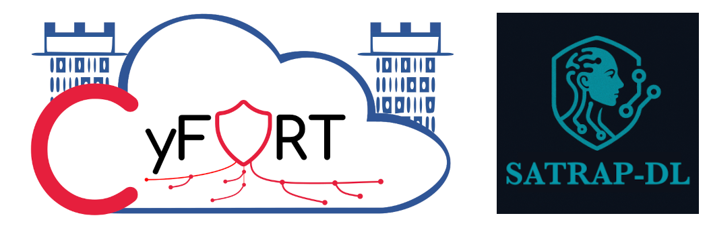
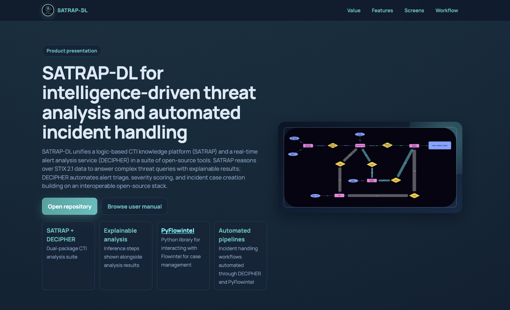

# SATRAP-DL



SATRAP-DL, short for **Semi-Automated Threat Reconnaissance and Analysis Powered by DECIPHER Logic**, offers a suite of tools for computer-aided cyber-threat intelligence (CTI) analysis and automated incident handling informed by CTI.

For a visual stakeholder-oriented tour of SATRAP-DL, visit the **[product presentation page](https://abstractionslab.github.io/satrap-dl/website/product-presentation.html)**.



## Table of contents

- [SATRAP-DL suite](#satrap-dl-suite)
- [Quick map](#overview)
- [Getting started](#getting-started)
- [Documentation and technical specifications](#documentation-and-technical-specifications)
- [License](#license)
- [Acknowledgments](#acknowledgments)
- [Contact](#contact)

## SATRAP-DL suite

- [**SATRAP**](satrap/README.md) provides a platform for (semi-)automated analysis of CTI based on a knowledge representation system for explainable inference. It aims to reduce the manual effort involved in correlating threat intelligence and deriving actionable conclusions, while keeping the analysis over STIX 2.1 CTI data traceable.

- [**DECIPHER**](decipher/README.md) provides an extensible REST service for real-time analysis and severity scoring of alert information and incident case creation for streamlined investigations of threat scenarios.

- [**PyFlowintel**](https://github.com/AbstractionsLab/PyFlowintel) is a Python library for interacting with the case management platform [Flowintel](https://github.com/flowintel/flowintel) through its REST API. PyFlowintel is used to support automated pipelines in DECIPHER.

## Quick map

This repository contains the source code, [technical specifications](https://abstractionslab.github.io/satrap-dl/traceability/index.html), and user documentation of SATRAP-DL, developed based on the [C5-DEC SSDLC](https://github.com/AbstractionsLab/c5dec/blob/main/docs/manual/ssdlc.md) methodology and associated [C5-DEC CAD](https://abstractionslab.github.io/c5dec/website/product-presentation.html) software.

The repository is organized as follows:

- [satrap/](satrap/): SATRAP Python package (KRS, ETL, CLI, analysis toolbox)
- [decipher/](decipher/): DECIPHER Python package (analysis REST service)
- [deployment/](deployment/): artifacts to deploy the operational environments of DECIPHER and SATRAP
- [docs/](docs/): user manuals, notebooks, specs, and traceability artifacts
- [tests/](tests/): unit and integration tests
- [tutorials/](tutorials/): workshop and tutorial materials
- [.devcontainer/](.devcontainer/): VS Code configuration for a ready-to-use containerized development environment.

The PyFlowintel library is hosted in a [separate repository](https://github.com/AbstractionsLab/PyFlowintel).

## Getting started

For detailed setup and usage instructions of each sub-system, please refer to the corresponding [SATRAP](satrap/README.md) or [DECIPHER](decipher/README.md) README.

### Developers
For deploying a containerized development environment for the whole SATRAP-DL project in Visual Studio Code ... See the installation section in the user manual for details.

#### Unit and integration tests

The repository includes a single script to run tests for both SATRAP and DECIPHER.

- Run all tests (SATRAP + DECIPHER)
```bash
./run_tests.sh
```

- Run only either SATRAP or DECIPHER tests
```bash
./run_tests.sh <satrap|decipher>
```

- Run individual test modules, classes and cases using the `unittest` module. For example:

```sh
python -m unittest tests.satrap.file_util_test
```

See the README files of each project for more details about the test suites.

## Documentation and technical specifications

The technical specifications of SATRAP-DL including requirements, architecture design, software design and test artifacts, are available on a dedicated [traceability web page](https://abstractionslab.github.io/satrap-dl/traceability/index.html). 

See the [SATRAP-DL user manual](docs/manual/README.md) for usage guidance on each component of the suite.

## License

Copyright (c) itrust Abstractions Lab and itrust consulting. All rights reserved.

SATRAP-DL is licensed under the [GNU Affero General Public License (AGPL) v3.0](LICENSE) license.

**Note**: SATRAP incorporates a few ideas concerning the inference rules and the analysis functionality from [typedb-cti (2.x)](https://github.com/typedb-osi/typedb-cti/tree/2.x), an open-source project licensed under [Apache License 2.0](./satrap/assets/schema/LICENSE). During the conceptual phase of SATRAP-DL, we considered building SATRAP on top of typedb-cti as they are close in spirit. However, we opted for a fresh development mainly for two reasons:

- the design of typedb-cti was not compatible with the ambitions and architectural requirements of SATRAP
- typedb-cti (2.x) relies on an outdated version of TypeDB 2.x, incompatible with the latest release at the time (2.27).


## Acknowledgments

SATRAP-DL is a sub-project of [CyFORT](https://abstractionslab.com/index.php/research-and-development/cyfort), "Cloud Cybersecurity Fortress of Open Resources and Tools for Resilience", co-funded by the Ministry of the Economy of Luxembourg in the context of the EC-approved [IPCEI-CIS](https://ec.europa.eu/commission/presscorner/detail/en/ip_23_6246) project.


## Contact
For more information about the project, feedback, questions or feature requests, feel free to contact us at Abstractions Lab: info@abstractionslab.lu

**Community feedback is welcome!**
