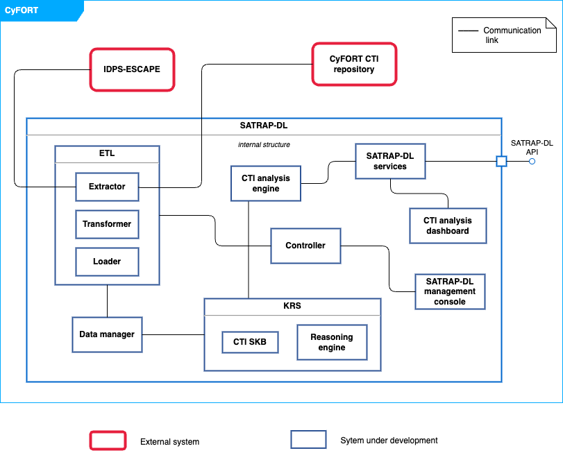

# System structure overview

This UML composite structure diagram shows the overview of SATRAP-DL along with the systems on which it has some dependency.

Roughly, the components are described as follows:

|Component name | Component description|
|---------------|----------------------|
|CTI Knowledge representation system | Semantic Knowledge Base of CTI (CTI SKB) defined on a strongly-typed data model, plus an automated logic-based reasoning engine.         |
|Data manager | Manages the interactions and connection to the knowledge base |
|ETL module          | Enables ingesting data from diverse categories into the CTI SKB, for instance, cybersecurity knowledge (e.g., datasets from MITRE ATT&CK), behavioral data (from SIEMs, SOARs, etc.) and external CTI (from platforms like MISP). |
|CTI analysis engine | Implements queries tailored for the automation of Cyber Threat Intelligence (CTI) analysis tasks.         |
|Controller | Responsible for handling the interaction between the SATRAP-DL management console and the ETL module . |
|SATRAP-DL services  | Make SATRAP-DL's functionality accessible via a Python library and a language-independent API.  |
|SATRAP-DL frontend  | A suite of user interfaces for executing and visualizing results of analytic queries over the CTI SKB and performing data management and admin tasks in the CTI SKB.          |

More details are available as part of the system concept in the file `2B1D_REP_CyFORT-SATRAP-DL-SystemArchitecture_v1.1`.