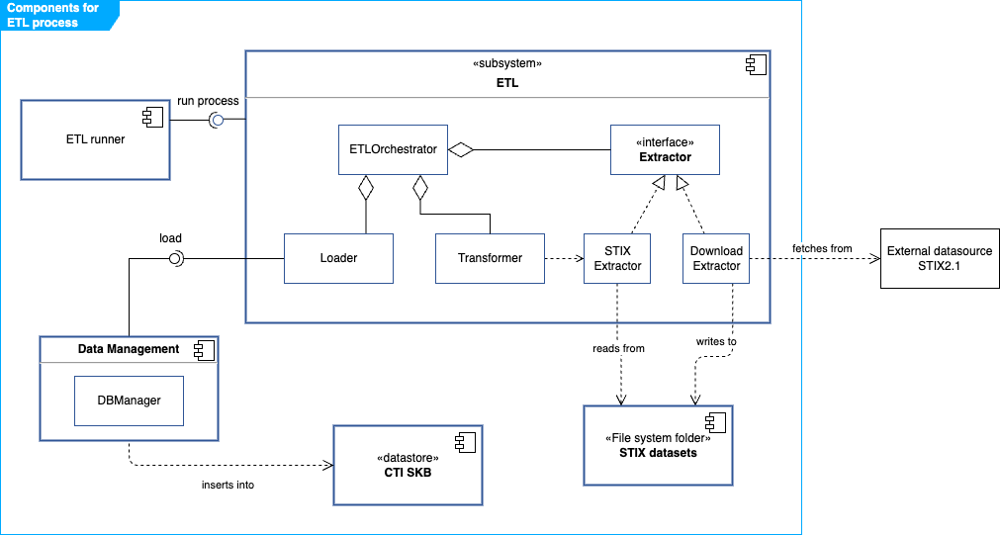

# ETL components

The following diagram depicts the main components of the ETL system.

Roughly, the `ETLOrchestrator` is in charge of the logic for executing the ETL process assisted by an `Extractor`, a `Transformer` and a `Loader`.

A suitable `Extractor` fetches data from an external source and creates and stores a datasource in STIX 2.1 format in a predefined folder. For the initial version, we will only consider an extractor for datasources already in STIX 2.1, namely the `STIXExtractor`. In future phases, the integration of data in other formats can be supported by extending the architecture with new Extractors.

The ETL subsystem interacts with the following components:

- **ETL runner**: this is the component that triggers the ETL process according to predefined settings.
- **STIX datasets**: a predefined folder in the file system storing datasets in STIX2.1 JSON format.
- **CTI SKB**: the database of SATRAP in TypeDB.
- **Data Management**: includes components aimed at handling data, such as the DB manager which manages the connections and operations over the CTI SKB. Some of the functions in this class are: `create_db`, `setup_schema`, `load_db_data`, `insert` and `delete`.