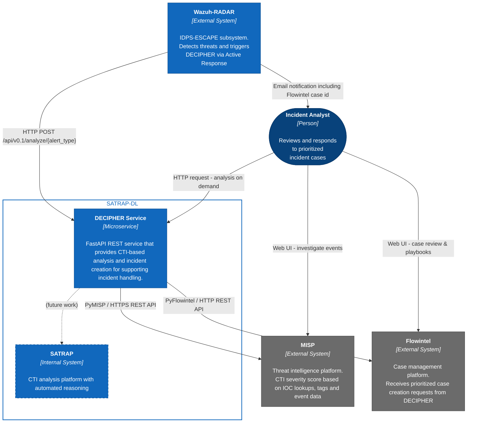

# DECIPHER context diagram

The diagram below depicts the DECIPHER REST service in its operational context for incident handling, showing the key external systems it interacts with and the primary user persona. Arrows indicate the direction of interaction or data flow.

{width="75%"}