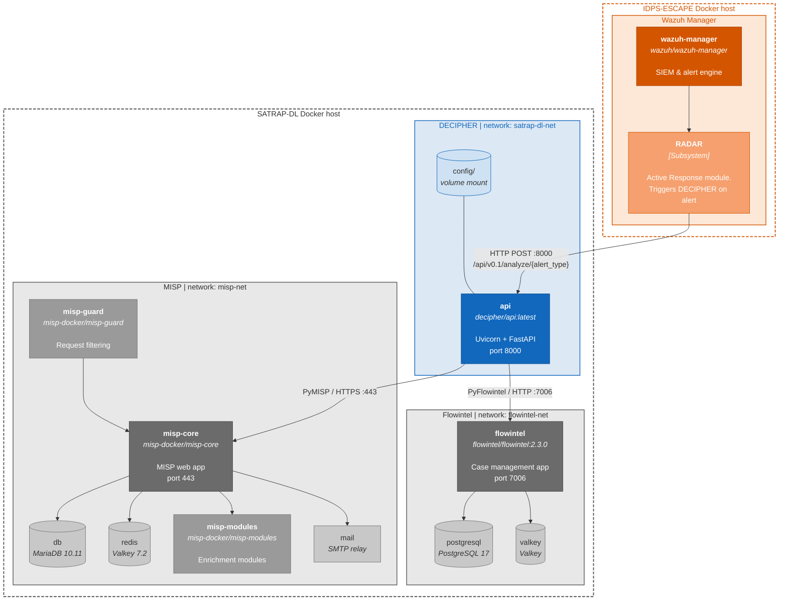

# DECIPHER infrastructure deployment diagram

The DECIPHER infrastructure stack consists of four containerized services: the **DECIPHER REST analysis API**, the **MISP** threat intelligence platform, the **Flowintel** case management system, and the **Wazuh** SIEM with the **RADAR** active response module acting as the external alert source. The deployment of Wazuh/RADAR falls outside the scope of SATRAP-DL, yet, we include it here for depicting the complete context of the DECIPHER infrastructure.

The diagram depicts a representative two-host deployment, yet, the number of nodes is flexible thanks to the containerized architecture. The Wazuh/RADAR subsystem runs on a dedicated IDPS-ESCAPE host and triggers analysis by posting alerts to the DECIPHER API over the network. MISP, Flowintel, and the DECIPHER API container are co-located on the SATRAP-DL host, each isolated in its own Docker network. A `config` volume mount supplies runtime configuration to the API container without rebuilding the image.

{width="75%"}

### Channels between trust boundaries

SRS-058 requires TLS 1.2 or higher for all data in transit crossing a trust boundary.
In the depicted diagram this would apply to the connections between the Wazuh/RADAR subsystem and the DECIPHER API if the IDPS-ESCAPE and SATRAP-DL hosts are located in different trust zones.

Possible solutions include:
- Supporting HTTPS in the REST API and configuring the Wazuh/RADAR subsystem to use HTTPS when posting alerts to the DECIPHER API. This would require setting up TLS certificates on the DECIPHER host and configuring the API to serve over HTTPS.
- Deploying the IDPS-ESCAPE and SATRAP-DL hosts inside the same trust boundary, defined as a network environment where inter-host communication is restricted to authorized endpoints and protected from external access by a common perimeter control (e.g. a dedicated VPN or an isolated network segment with enforced in/out filtering).