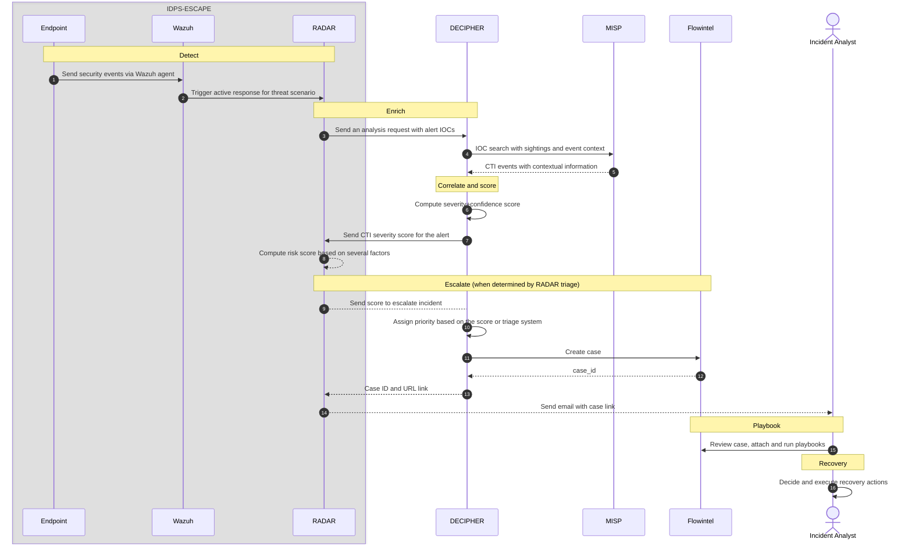

# RADAR-DECIPHER pipeline overview

The diagram below depicts the end-to-end automated incident **(H)andling** pipeline
supported by the Wazuh/RADAR subsystem, the DECIPHER REST service, MISP, Flowintel, and the incident analyst. The sequence is triggered by RADAR in response to a detected alert scenario and culminates in the creation of a Flowintel case with an assigned priority, which an analyst can then review and enrich with playbooks.

1. **(D)etect** and create alerts in Wazuh for the selected threat scenario.
2. **(E)nrich** by searching for CTI related to the alert IOCs in MISP
3. **(C)orrelate** and determine a CTI severity score via an automated preliminary analysis on the enriched alerts.
4. Compute a risk score on the alert based on detection and CTI factors, and assign a triage tier.
5. When determined by the tier, **(E)scalate (I)ncidents** to prioritized Flowintel cases.
6. Add relevant **(P)laybooks** to the case for further interactive analysis.

**(R)ecovery** actions are left to the judgment of incident responders. Analysis and playbook outcomes can inform recovery decisions.

