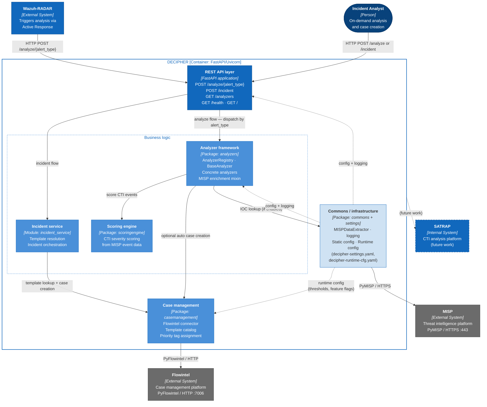

# DECIPHER microservice container diagram

The high-level architecture of the DECIPHER microservice with endpoints and modules is depicted in the diagram below. Arrows between nodes show the direction of call or data flow.

DECIPHER runs as a single deployable container internally structured into four functional layers plus a cross-cutting infrastructure layer:

- **REST API layer** — the process that owns all HTTP endpoints and performs request routing and response serialization (SRS-049).
- **Analyzer framework** — the module responsible for providing the analysis service.
- **Scoring engine** — computes a normalized CTI severity score from raw MISP event data; consumed by analyzers and independent of transport concerns.
- **Case management** — wraps PyFlowintel to create and prioritize Flowintel cases; used by both the analysis flow (optional auto-creation) and the incident flow (explicit creation).
- **Commons / infrastructure** — cross-cutting layer providing common functionality for the rest of the modules.

{width="80%"}