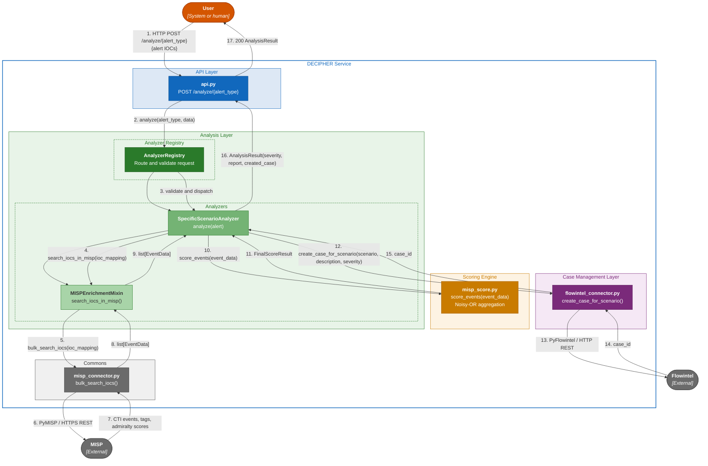

# REST service: analysis endpoint interaction

This diagram depicts an overview of a successful flow triggered by a request to the analysis endpoint. The general case without a specific threat scenario is depicted.

