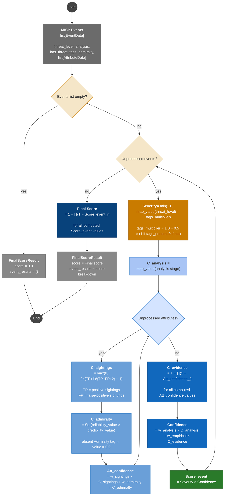

# Analysis endpoint: scoring data flow diagram

The diagram below depicts the data flow of the score computation specified in SRS-053. Inputs flow top-to-bottom through two parallel axes, severity and confidence, which are multiplied at event level.
Event scores are then aggregated into a final score via Noisy-OR.

The final result includes the total score with a breakdown of the calculation for analysis purposes.

The partial formulas make use of configurable factors which must be dynamically obtained from a configurable source – e.g., a YAML file. The default parameters depicted in the flowchart are as follows:

| Parameter                | Value                  | Default  numeric value |
|--------------------------|-----------------------------|---------|
| Threat level             | undefined                   | 0.0     |
| Threat level             | low                         | 0.25    |
| Threat level             | medium                      | 0.5     |
| Threat level             | high                        | 1.0     |
| Tags multiplier          | Threat-indicating tags present          | 1.5     |
| Analysis stage           | initial                     | 0.2     |
| Analysis stage           | ongoing                     | 0.5     |
| Analysis stage           | completed                   | 1.0     |
| Confidence weight        | analysis                    | 0.5     |
| Confidence weight        | empirical                   | 0.5     |
| Attribute weight         | sightings                   | 0.6     |
| Attribute weight         | admiralty                   | 0.4     |
| Source reliability       | A (completely reliable)     | 1.0     |
| Source reliability       | B (usually reliable)        | 0.8     |
| Source reliability       | C (fairly reliable)         | 0.6     |
| Source reliability       | D (not usually reliable)    | 0.4     |
| Source reliability       | E (unreliable)              | 0.2     |
| Source reliability       | F (reliability unknown)     | 0.1     |
| Source reliability       | G (deliberately misleading) | 0.0     |
| Info credibility         | 1 (confirmed by other sources) | 1.0  |
| Info credibility         | 2 (probably true)           | 0.8     |
| Info credibility         | 3 (possibly true)           | 0.6     |
| Info credibility         | 4 (doubtful)                | 0.4     |
| Info credibility         | 5 (improbable)              | 0.2     |
| Info credibility         | 6 (truth cannot be judged)  | 0.0     |

{width="70%"}