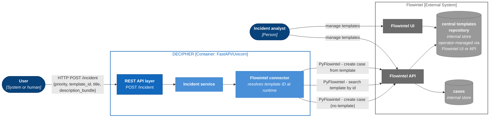

# REST service: incident endpoint interaction

The incident creation endpoint receives a bundle with a priority level from the MISP `priority-level` taxonomy and creates a case in Flowintel assigning it the corresponding priority tag.
If an optional `template_id` is provided in the request body, the case will be created based on the corresponding template; when no template with such an id is found the case is created without one.

In alignment with the separation of concerns principle, the creation and management of templates will be offloaded to Flowintel as this feature is already provided by the tool and further enhanced through a central repository of templates.

DECIPHER queries Flowintel at case-creation time to resolve the appropriate template from the given identifier, which is expected to be a valid template ID in the central templates repository of Flowintel.

Any additional key-value pairs provided in the request body are serialized into the case description in a readable format.

The diagram below shows the system-level interaction flow for a POST request to the incident endpoint.

