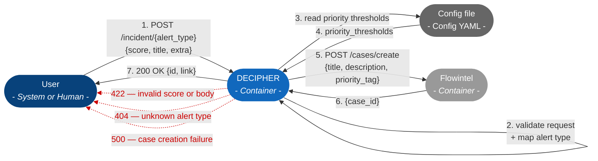

# REST service: incident endpoint interaction

The incident creation endpoint receives a score and creates a case in Flowintel prioritized by the score. The endpoint gets also a parameter indicating a threat scenario; this guides the selection of an appropriate template if it exists.

 The diagram below shows the system-level interaction flow for a POST request to the incident endpoint.

For a detailed sequence diagram (internal modules and error branches), see SWD-009.