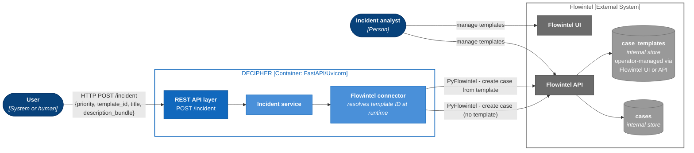

# REST service: incident endpoint interaction

## Initial approach: template catalog bundled in the image

The incident creation endpoint receives a bundle with a priority level from the MISP `priority-level` taxonomy and creates a case in Flowintel assigning it the corresponding priority tag. An optional `template_id` in the request body selects a scenario-specific case template from a template catalog initially pre-built in the case management module; when no template with such an id is found the case is created without one. Any additional key-value pairs provided in the request body are serialized into the case description in a readable format.

The diagram below shows the system-level interaction flow for a POST request to the incident endpoint.

```mermaid
%% Option A — both template content and bindings are bundled inside the image

flowchart LR
    analyst(["<b>User</b><br/><i>[Human or system]</i>"])
    flowintel["<b>Flowintel</b><br/><i>[External System]</i><br/>PyFlowintel / HTTP :7006"]

    subgraph decipher["DECIPHER  [Container: FastAPI/Uvicorn]"]
        direction TB
        api["<b>REST API layer</b><br/>POST /incident"]
        incident["<b>Incident service</b>"]

        subgraph casemanagement["Case management"]
            direction LR
            catalog["<b>TemplateCatalog</b><br/><br/>JSON files bundled in image<br/>mapping wired in code<br/><i>(fully developer-managed)</i>"]
            connector["<b>Flowintel connector</b>"]
        end
    end

    analyst  -->|"HTTP POST /incident<br/>{priority, template_id, title, description_bundle}"| api
    api      --> incident
    incident --> catalog
    catalog  --> connector
    connector -->|"PyFlowintel - create case"| flowintel

    style analyst     fill:#08427b,color:#fff,stroke:#083566
    style flowintel   fill:#6b6b6b,color:#fff,stroke:#444
    style decipher    fill:transparent,stroke:#1168bd,stroke-width:2px,color:#1168bd
    style casemanagement fill:transparent,stroke:#4a90d9,stroke-width:1px,stroke-dasharray:4 2,color:#1168bd
    style api         fill:#1168bd,color:#fff,stroke:#0e4d8c
    style incident    fill:#4a90d9,color:#fff,stroke:#1168bd
    style catalog     fill:#4a90d9,color:#fff,stroke:#1168bd
    style connector   fill:#4a90d9,color:#fff,stroke:#1168bd
```

## Future work: Flowintel central template repository when supported

When a centralized templates repository is fully supported in Flowintel (in development as of March 2026), the creation and management of templates will be offloaded to Flowintel as this is already part of the tool's responsibilities and aligns with the principle of separation of concerns.

DECIPHER queries Flowintel at case-creation time to resolve the appropriate template by a known identifier (e.g. a provided template ID). The API contract of the incident endpoint would remain unchanged, but the implementation of the incident service would need to accommodate the new template discovery mechanism and the dynamic nature of the available templates.

