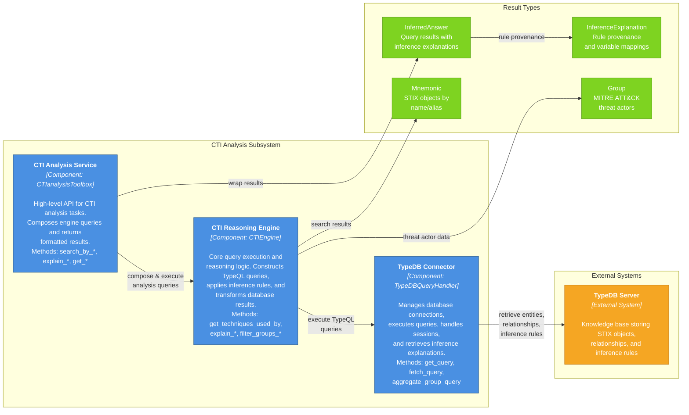

# CTI analysis subsystem design

The Cyber Threat Intelligence (CTI) analysis subsystem is a core component of SATRAP responsible for providing intelligent reasoning and analytics over the CTI knowledge base. The following diagram depicts the main internal components in a layered design that provides clear separation of concerns: high-level analysis logic in the service layer, query composition in the engine, and database interaction in the connector.

### CTI Analysis Service (`CTIanalysisToolbox`)

Entry point for users and applications. Provides high-level methods for:

- **Search operations**: `search_by_stix_id`, `search_by_mitre_id`, `search_by_alias_name`
- **Analysis methods**: `explain_techniques_used_by_groups`, `explain_if_related_mitigation`
- **Aggregation queries**: `get_sdo_stats`, `mitre_attack_groups`, `mitre_attack_techniques`
- **Filtering and ranking**: `summarize_techniques_usage`, `techniques_used_by_groups`

### CTI Reasoning Engine (`CTIEngine`)

Core reasoning component implementing:

- **Object discovery**: Search STIX objects by STIX ID, MITRE ATT&CK ID, name, or alias
- **Inference execution**: Apply TypeDB inference rules to derive new facts (techniques used by groups, related mitigations)
- **Explanation generation**: Capture and format inference rule applications for traceability
- **Analytics**: Aggregate statistics on SDO types, techniques per group, group coverage
- **Filtering**: Apply keywords, revocation status, and other criteria to results

### TypeDB Connector (`TypeDBQueryHandler`)

Low-level database interaction component:

- Manages TypeDB driver sessions
- Executes TypeQL queries and retrieves `ConceptMap` results
- Extracts entity attributes and relationships from results
- Retrieves and formats inference explanations from the reasoning engine

## Data flow

A typical CTI analysis request flows as follows:

1. User calls a method on `CTIanalysisToolbox` (e.g., `explain_techniques_used_by_groups`)
2. `CTIanalysisToolbox` delegates to `CTIEngine` with analysis parameters
3. `CTIEngine` constructs a TypeQL query and invokes `TypeDBQueryHandler.get_query()`
4. `TypeDBQueryHandler` executes the query against the TypeDB server
5. Results are retrieved as `ConceptMap` objects, optionally with inference explanations
6. `CTIEngine` transforms results into domain-specific types (`Group`, `Mnemonic`, `InferredAnswer`)
7. `CTIanalysisToolbox` formats results (e.g., as tables or lists) and returns to user