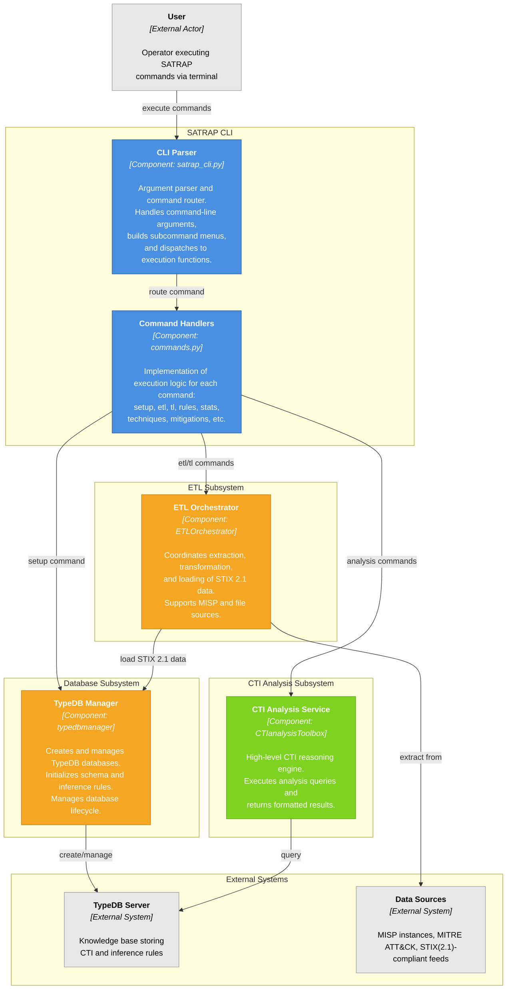

# SATRAP command-line interface design

The SATRAP command-line interface (CLI) is primarily intended for setting up a fresh CTI knowledge base and executing an extract-transform-load (ETL) pipeline to populate the knowledge base with STIX 2.1 data.

A minimal set of analytical functions will be made available through this interface, however, the main interface for CTI analysis is foreseen to be Jupyter notebooks using the `CTIAnalysis Toolbox`, which provides a larger set of functions.

The following diagram depicts the main CLI components and their interactions with the underlying subsystems.

{width="75%"}

The SATRAP CLI provides the following command groups:

### Database and ETL commands

- **`setup`**: Create a fresh CTI semantic knowledge base with schema and inference rules. Options: `--database`, `--delete`, `--testmode`
- **`etl`**: Full Extract-Transform-Load pipeline from MISP or file sources. Options: `--xmode`, `--src`, `--database`, `--apikey`, `--test`
- **`tl`**: Transform-Load only, for working with pre-extracted STIX files. Options: `--src`, `--database`

### Analysis commands

- **`rules`**: Display all inference rules defined in the knowledge base
- **`stats`**: Show statistics of STIX Domain Objects (SDOs) by type
- **`techniques`**: List all MITRE ATT&CK techniques in the knowledge base with optional filtering
- **`mitigations`**: Display all MITRE ATT&CK mitigations
- **`search`**: Search for STIX objects by STIX ID, MITRE ID, or name/alias
- **`info-mitre`**: Retrieve detailed information about a threat group
- **`mid`**: Convert a STIX ID to its MITRE ATT&CK ID

### Default flags

- **`--help`**: Show help message with command usage and options
- **`--version`**: Display the current version of SATRAP

## Component interactions
The role of each depicted component is summarized next:

### CLI Parser (`satrap_cli.py`)

- Initializes argument parser with global options (server URI, timeout)
- Builds subcommand menus for all commands
- Routes user input to appropriate command handler
- Handles keyboard interrupts and exceptions

### Command Handlers (`commands.py`)

Each command handler (`exec_*` function) implements:
- Argument validation and default configuration
- Error handling specific to the command
- Integration with backend subsystems
- Result formatting and display to user

### Subsystem Integration

- **ETL operations**: Commands invoke `ETLOrchestrator` for data ingestion and `TypeDB Manager` for schema initialization
- **Database operations**: Setup command uses `TypeDB Manager` to create fresh instances
- **Analysis operations**: Analysis commands delegate to `CTIanalysisToolbox` for intelligent querying