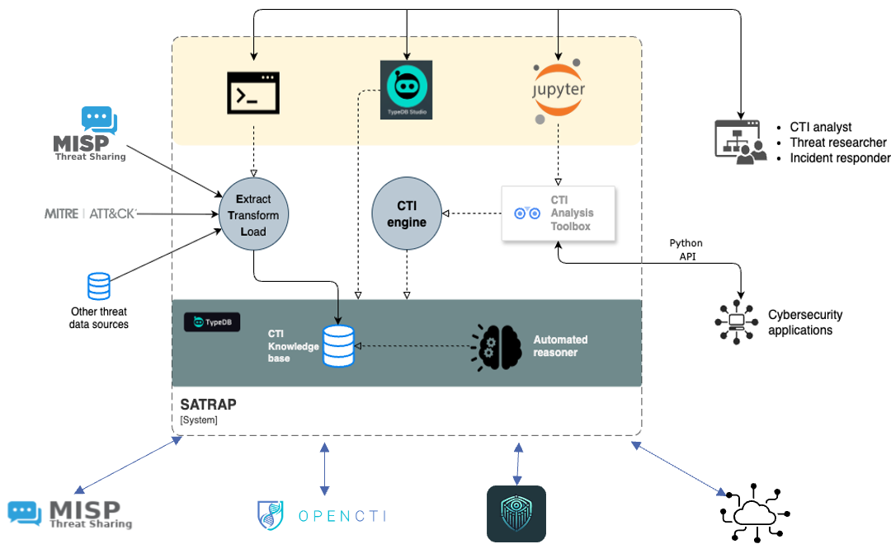

# SATRAP context diagram

The diagram below shows the context in which SATRAP is foreseen to be used, including main users and interaction with other systems in the ecosystem of SATRAP-DL.

The core processes of SATRAP enable an ETL pipeline to populate a knowledge base with cyber threat intelligence data, over which automated reasoning, semantic searches, and semantic-based CTI analysis can be performed.

The connectors to external TIPs and cybersecurity tools enable data exchange with SATRAP and the SATRAP-DL’s CTI repository.

The use of TypeDB Studio as a native interface to the TypeDB database enables inherent support for semantic queries, which is further enriched and simplified through the `CTIAnalysis Toolbox` service.

To benefit from the set of mature capabilities and automation of MISP, this TIP has been selected to implement the central CTI repository of CyFORT.

