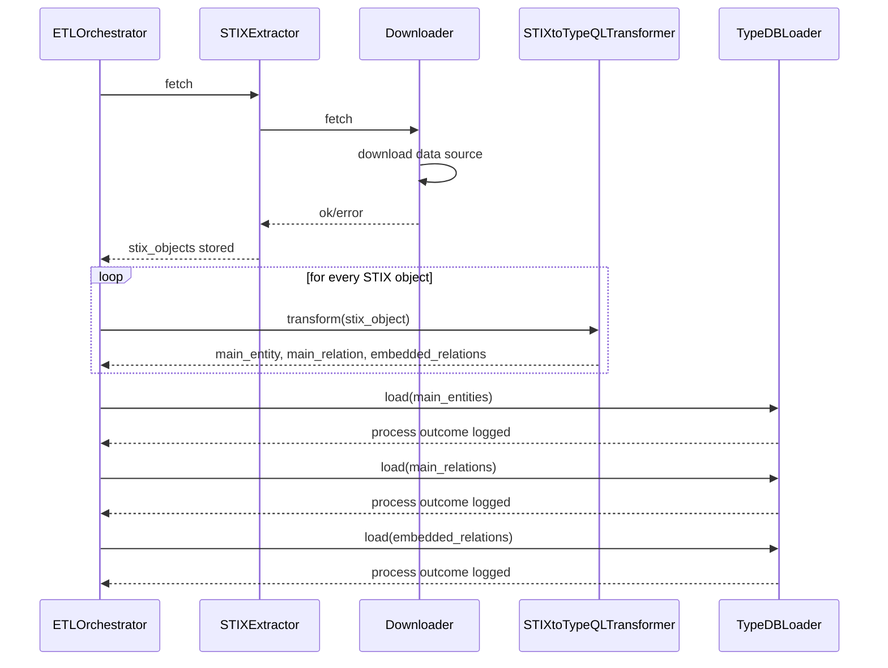

# ETL system flow

The sequence diagram below depicts the interaction of the ETL Orchestrator with the concrete classes shown above for a complete extract-transform-load process execution.

{width="70%"}

The MITRE ATT&CK data file is downloaded by the Downloader. Then, the STIX objects are read and parsed by the STIXExtractor. With this, the extraction process is completed.

Next, the STIXtoTypeQLTransformer transforms each STIX Object into TypeDB insert queries.

Once they are transformed, they are loaded into a TypeDB database by the TypeDBLoader in 3 steps. First, entities that represent STIX objects, then relations that represent STIX objects and at last relations that represent embedded relations.