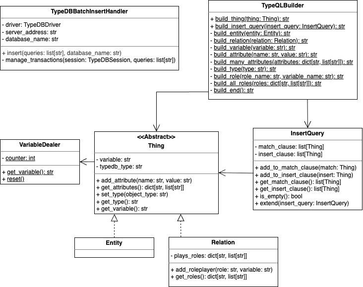

# TypeDB utilities

As the ETL process will load the data into a TypeDB database, dedicated functionality for TypeDB objects is required.
Instead of hardcoding this functionality like string creation for the insert queries into the main ETL components, a separate typedb package to handle all TypeDB functionality is created. This package belongs to the `datamanagement` layer and can be used in more contexts than just ETL systems.

The class diagram below shows an overview of the relevant classes for the ETL in the typedb package.

{: width="70%"}

**VariableDealer** This class has two static functions get_variable and reset. The VariableDealer is responsible for distributing variables for TypeQL queries that are always unique. This is required so different statements in a single insert query do not affect each other

**Entity & Relation** The Entity and the Relation classes represent TypeDB’s entity and relation objects. The classes are mainly data classes. They have a common supertype Thing analogous to TypeDB’s thing type (which is deprecated and will be removed in TypeDB 3.01) that has the functionality for assigning variables and attributes. In addition, relations have roles and roleplayers.

**InsertQuery** The InsertQuery data class represents insert queries that consist of match and insert statements.

**TypeQLBuilder** The TypeQLBuilder builds queries as strings for certain TypeDB Objects. For example it can build the string representation for InsertQuery objects.

**TypeDBBatchInsertHandler** The TypeDBBatchInsertHandler handles insertions into a TypeDB database in batches. For communication with the database, it makes use of the official TypeDB driver package. This class can be used as a context manager or as a regular class. The usage in the `with` block (context manager) automatically takes care of creating and closing the TypeDBDriver connection, while using the Inserter without the `with` block allows using it when the driver has already been set up by another class or is still needed after the inserter finished his work. The insertion queries are passed as strings.