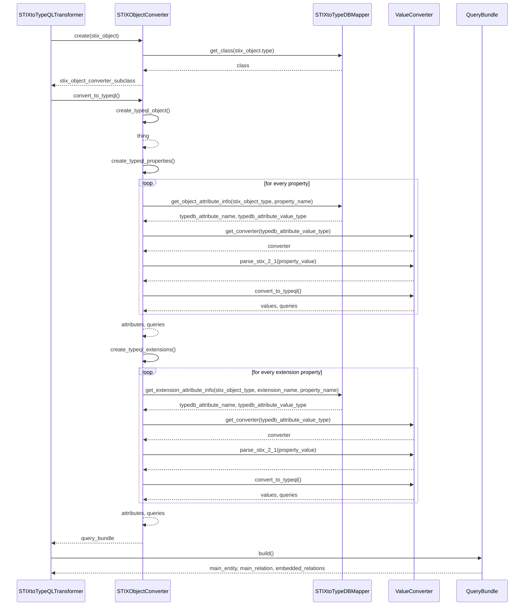
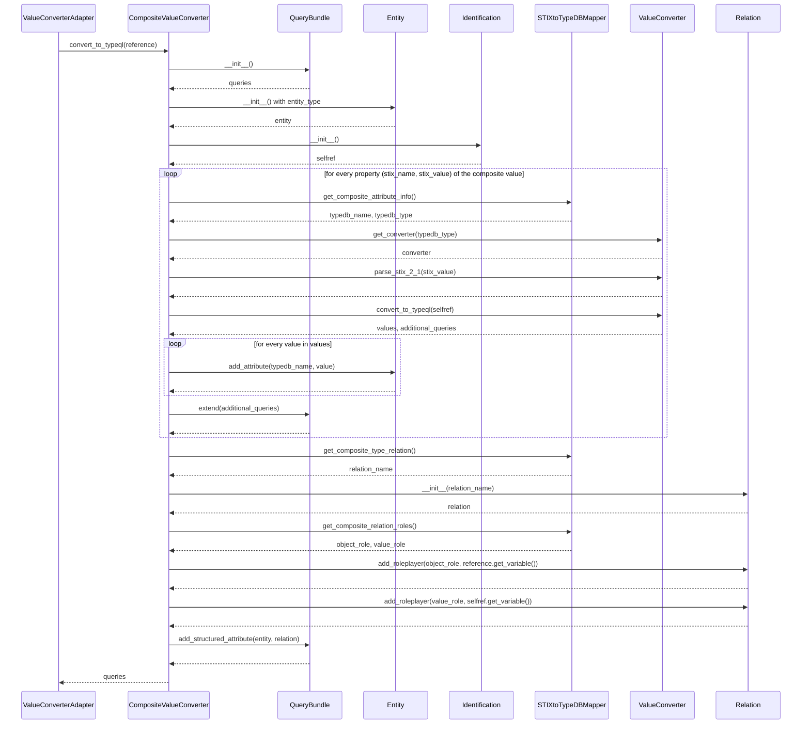

# Transformer flow

## Transformer sequence diagram

The sequence diagram of the transformation process can be seen below:

<!-- {: width="80%"} -->

{width="80%"}

Only function calls and interactions that are relevant to understand the information flow are shown. Especially interaction with plain data classes that are not used by the `STIXtoTypeQLTransformer` itself are left out, i.e. the creation of `Entity` or `Relation` objects that are inserted into `InsertQuery` objects which are again part of the `QueryBundle`. In addition, the `convert_to_typeql` functions differ a lot depending on the value type. For primitive data types, the functions indeed do not interact with other classes. However, for more complex data types, the `ValueConverter` interacts with the `STIXtoTypeDBMapper` to ask for information about the conversion steps and of course with the `Identity`, `Entity`, `Relation`, `InsertQuery` and therefore also with the `QueryBundle`.

To provide an example, the sequence diagram for a function call of `convert_to_typeql` of a composite value can be seen below:

It can be seen that for every value in a composite value's properties, the ValueConverter is needed to convert the value. This is not shown in this sequence diagram as this sequence diagram already explains this step.