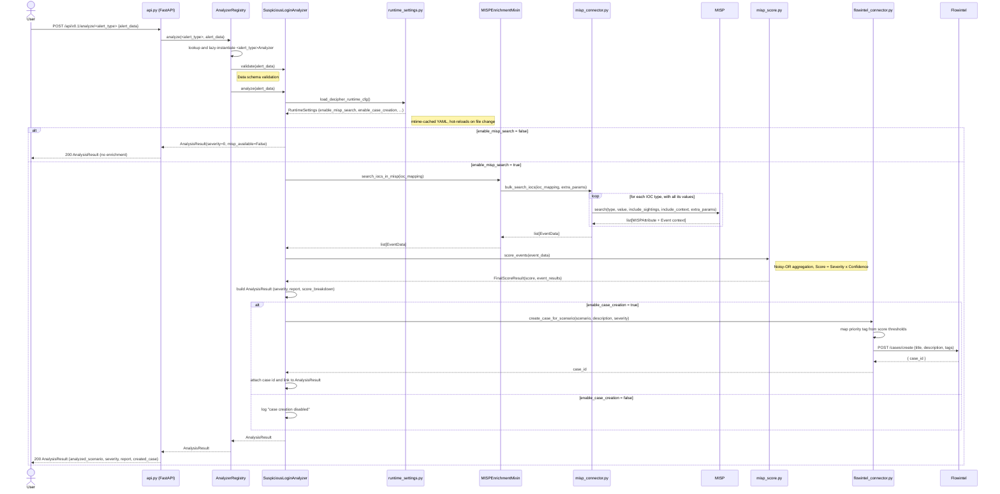
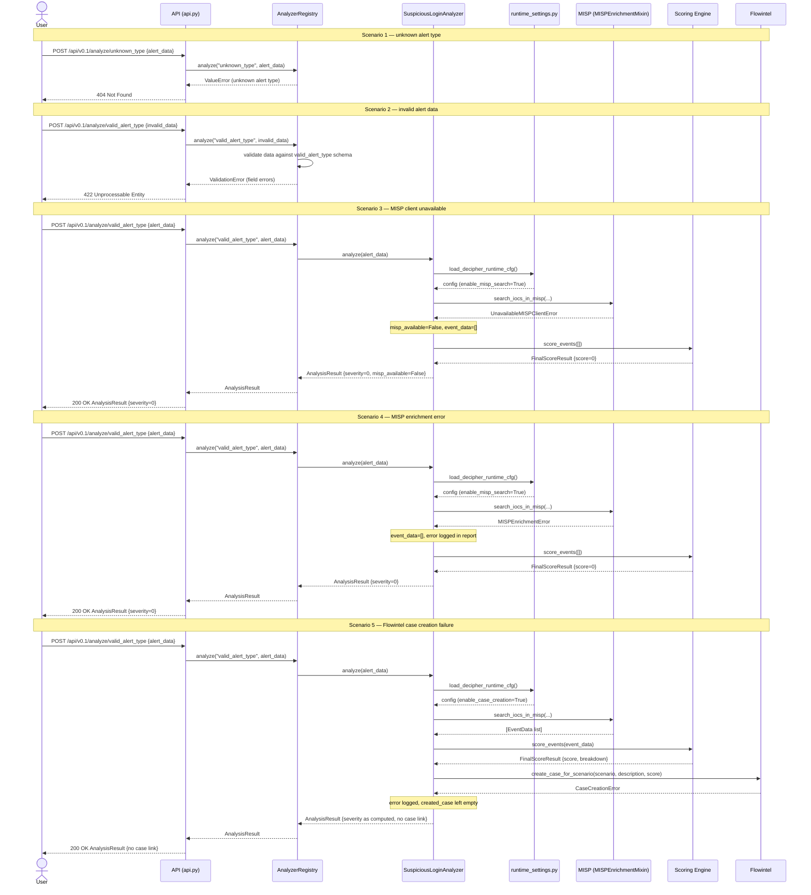

# Analysis endpoint flow

The sequence diagram below depicts the flow of a CTI analysis request, from the initial POST request to the `/analyze/<alert_type>` endpoint to the final response containing the analysis results.

## Successful flow

## Erroneous paths

Five error scenarios are distinguished by fault origin. Scenarios 1 and 2 terminate before the analyzer is invoked. Scenarios 3 and 4 return 200 with score 0. Scenario 5 returns 200 with no case link.

