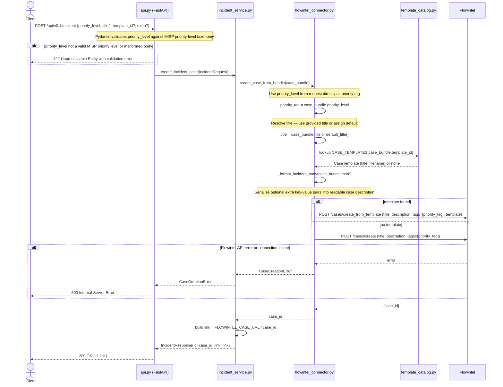

# Incident endpoint flow

The diagram below details the full request lifecycle of `POST /incident`, including required validations and error paths.

```mermaid
sequenceDiagram
    actor Client as Client
    participant API as api.py (FastAPI)
    participant IncidentSvc as incident_service.py
    participant FlowConn as flowintel_connector.py
    participant TemplateCatalog as template_catalog.py
    participant Flowintel as Flowintel

    Client->>API: POST /api/v0.1/incident {priority_level, title?, template_id?, extra?}

    note over API: Pydantic validates priority_level against MISP priority-level taxonomy
    alt priority_level not a valid MISP priority level or malformed body
        API-->>Client: 422 Unprocessable Entity with validation error
    end

    API->>IncidentSvc: create_incident_case(IncidentRequest)

    IncidentSvc->>FlowConn: create_case_from_bundle(case_bundle)

    note over FlowConn: Use priority_level from request directly as priority tag
    FlowConn->>FlowConn: priority_tag = case_bundle.priority_level

    note over FlowConn: Resolve title — use provided title or assign default
    FlowConn->>FlowConn: title = case_bundle.title or default_title()

    FlowConn->>TemplateCatalog: lookup CASE_TEMPLATES[case_bundle.template_id]
    TemplateCatalog-->>FlowConn: CaseTemplate (title, filename) or none

    FlowConn->>FlowConn: _format_incident_body(case_bundle.extra)
    note over FlowConn: Serialize optional extra key-value pairs into readable case description

    alt template found
        FlowConn->>Flowintel: POST /cases/create_from_template (title, description, tags=[priority_tag], template)
    else no template
        FlowConn->>Flowintel: POST /cases/create (title, description, tags=[priority_tag])
    end

    alt Flowintel API error or connection failure
        Flowintel-->>FlowConn: error
        FlowConn-->>IncidentSvc: CaseCreationError
        IncidentSvc-->>API: CaseCreationError
        API-->>Client: 500 Internal Server Error
    end

    Flowintel-->>FlowConn: {case_id}
    FlowConn-->>IncidentSvc: case_id
    IncidentSvc->>IncidentSvc: build link = FLOWINTEL_CASE_URL / case_id
    IncidentSvc-->>API: IncidentResponse(id=case_id, link=link)
    API-->>Client: 200 OK {id, link}
```