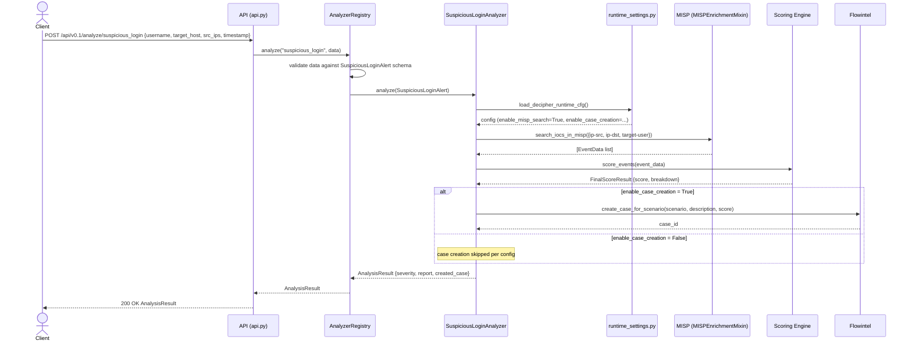

# Analysis endpoint: `suspicious_login` request flow

The sequence diagram below details the successful flow for `POST /api/v0.1/analyze/suspicious_login`. The Flowintel case creation step is abstracted as a single interaction; The erroneous paths correspond to those detailed in SWD-008.

The data schema bound to the `suspicious_login` alert type is `SuspiciousLoginAlert` as shown in SWD-013.

**Preconditions:** alert data passes schema validation, MISP search is enabled and reachable, case creation is optionally enabled or disabled per configuration.

