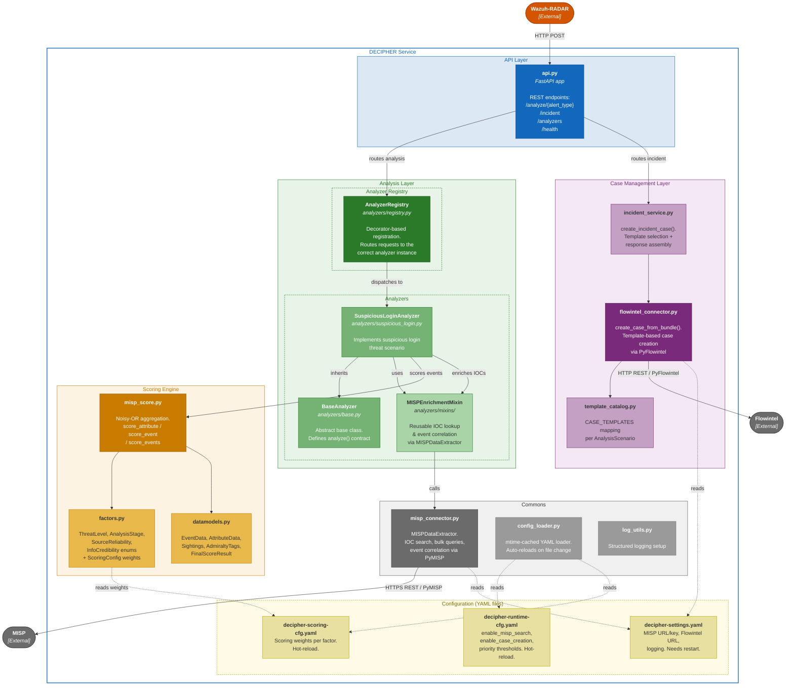

# DECIPHER REST service component diagram

This diagram expands the container diagram in ARC-008 at package level. Each node inside the DECIPHER boundary represents either a Python package or a top-level module; arrows show the direction of the call or data dependency.

The two primary entry points exposed by `api` correspond to the analysis flow (triggered by RADAR or an analyst via `POST /analyze/{alert_type}`) and the incident creation flow (triggered via `POST /incident`). In the analysis flow, `analyzers` orchestrates IOC enrichment through `commons.misp_connector`, feeds raw CTI event data to `scoringengine` to compute a severity score, and optionally delegates case creation to `casemanagement`. In the incident flow, `incident_service` resolves the optional template against `casemanagement.template_catalog` before calling `casemanagement.flowintel_connector` directly. The `commons` and `settings` packages provide cross-cutting infrastructure (logging, configuration, external client wrappers) consumed by all other packages.

{width="90%"}