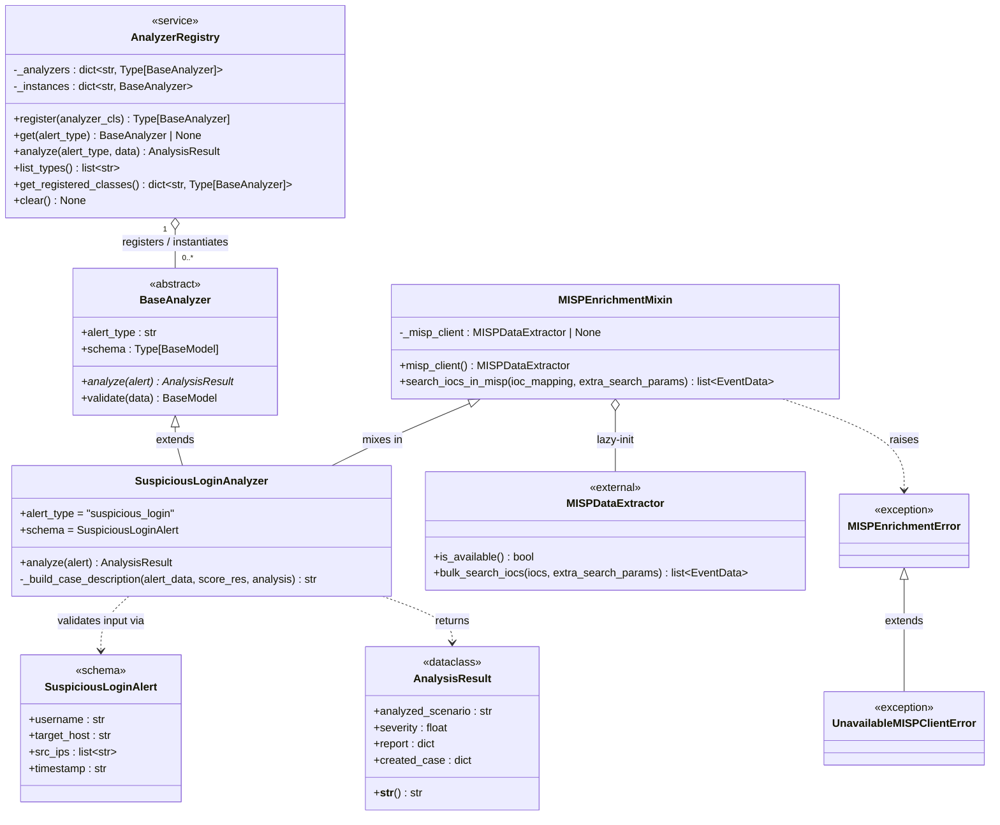

# Analysis layer class diagram

This diagram expands the **Analysis Layer** node from [SWD-011](SWD-011.md) into a UML class diagram, showing the concrete classes, their relationships, and the key attributes and operations exposed by each.

`AnalyzerRegistry` is the single static dispatcher: it holds class and instance registries keyed by `alert_type` and routes every analysis request. `BaseAnalyzer` defines the mandatory contract every analyzer must satisfy — a class-level `alert_type` string, a class-level `schema` (a Pydantic `BaseModel` subclass), and an abstract `analyze()` operation. `SuspiciousLoginAnalyzer` is a concrete implementation; it inherits `MISPEnrichmentMixin` to acquire lazy-initialised access to `MISPDataExtractor`. `SuspiciousLoginAlert` is the Pydantic input schema bound to that analyzer.

`AnalysisResult` (from `decipher.models`) is the uniform return type of every `analyze()` call and the response schema of the `/analyze` endpoint.

