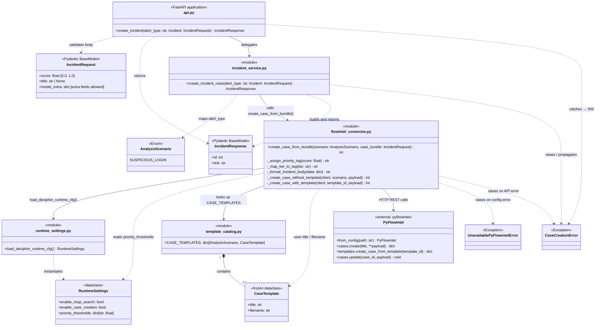

# Incident endpoint class diagram

The diagram below shows the classes, functions, and data models involved in the `POST /incident/{alert_type}` request.

Note that a refactoring is already foreseen, to remove the need for an alert type string in the endpoint path and instead provide an optional template name or ID as part of the request body. This would allow decoupling the incident creation logic from the analysis scenarios.

