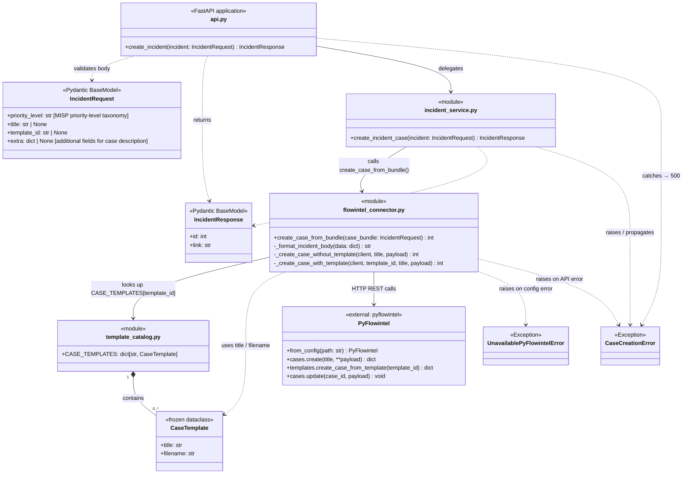

# Incident endpoint class diagram

The diagram below shows the classes, functions, and data models involved in the `POST /incident` request.

```mermaid
classDiagram
    direction TB

    %% ── API layer ─────────────────────────────────────────────────────────

    class `api.py` {
        <<FastAPI application>>
        +create_incident(incident: IncidentRequest) IncidentResponse
    }

    %% ── Pydantic models ───────────────────────────────────────────────────

    class IncidentRequest {
        <<Pydantic BaseModel>>
        +priority_level: str  [MISP priority-level taxonomy]
        +title: str | None
        +template_id: str | None
        +extra: dict | None  [additional fields for case description]
    }

    class IncidentResponse {
        <<Pydantic BaseModel>>
        +id: int
        +link: str
    }

    %% ── Service layer ─────────────────────────────────────────────────────

    class `incident_service.py` {
        <<module>>
        +create_incident_case(incident: IncidentRequest) IncidentResponse
    }

    %% ── Case management layer ─────────────────────────────────────────────

    class `flowintel_connector.py` {
        <<module>>
        +create_case_from_bundle(case_bundle: IncidentRequest) int
        -_format_incident_body(data: dict) str
        -_create_case_without_template(client, title, payload) int
        -_create_case_with_template(client, template_id, title, payload) int
    }

    class CaseTemplate {
        <<frozen dataclass>>
        +title: str
        +filename: str
    }

    class `template_catalog.py` {
        <<module>>
        +CASE_TEMPLATES: dict[str, CaseTemplate]
    }

    %% ── Exceptions ────────────────────────────────────────────────────────

    class CaseCreationError {
        <<Exception>>
    }

    class UnavailablePyFlowintelError {
        <<Exception>>
    }

    %% ── External dependency ───────────────────────────────────────────────

    class PyFlowintel {
        <<external: pyflowintel>>
        +from_config(path: str) PyFlowintel
        +cases.create(title, **payload) dict
        +templates.create_case_from_template(template_id) dict
        +cases.update(case_id, payload) void
    }

    %% ── Relationships ─────────────────────────────────────────────────────

    `api.py`                  ..>  IncidentRequest          : validates body
    `api.py`                  ..>  IncidentResponse         : returns
    `api.py`                  -->  `incident_service.py`    : delegates
    `api.py`                  ..>  CaseCreationError        : catches → 500

    `incident_service.py`     -->  `flowintel_connector.py` : calls create_case_from_bundle()
    `incident_service.py`     ..>  IncidentResponse         : builds and returns
    `incident_service.py`     ..>  CaseCreationError        : raises / propagates

    `flowintel_connector.py`  -->  `template_catalog.py`    : looks up CASE_TEMPLATES[template_id]
    `flowintel_connector.py`  ..>  CaseTemplate             : uses title / filename
    `flowintel_connector.py`  -->  PyFlowintel              : HTTP REST calls
    `flowintel_connector.py`  ..>  UnavailablePyFlowintelError : raises on config error
    `flowintel_connector.py`  ..>  CaseCreationError        : raises on API error

    `template_catalog.py`     "1" *-- "0..*" CaseTemplate   : contains
```