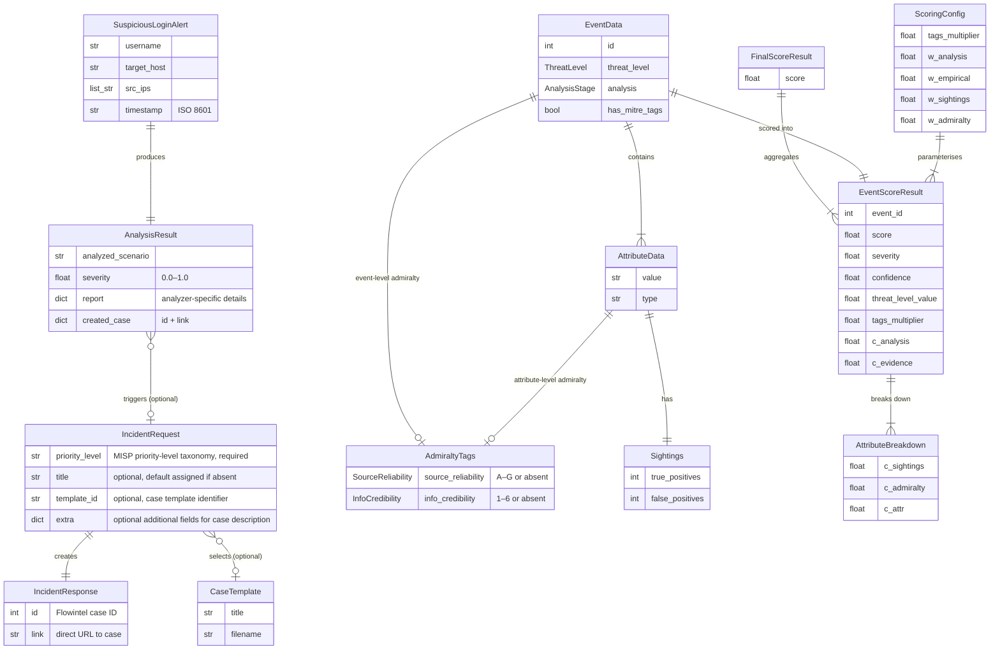

# DECIPHER microservice data model

The diagram below shows the data schemas used across the DECIPHER microservice. These include models for API request and response validation, as well as the dataclasses used in the scoring engine. The relationships between these models are also depicted, illustrating how data flows through the system from input to analysis results.

