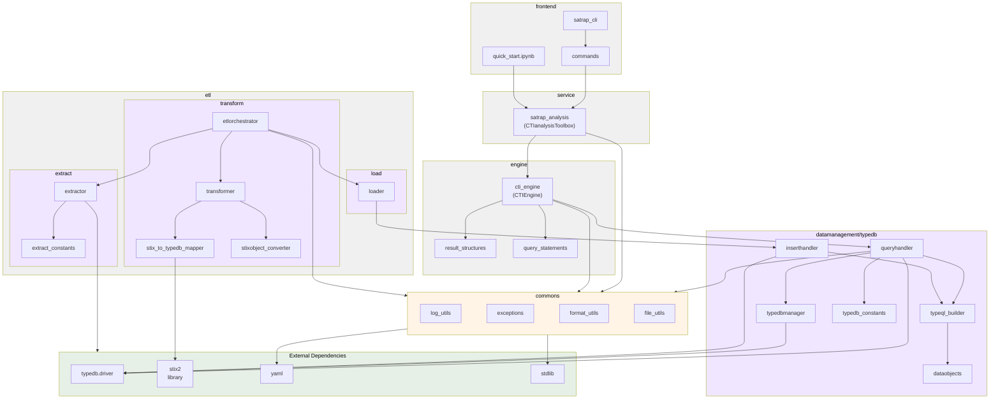

# SATRAP package diagram

SATRAP is organized into the six main packages depicted below:

### Commons (Shared functionality)
This package provides common functionality for all the other packages, to ensure consistency and reduce duplication. This includes logging, exception handling, file management and formatting utilities.

### Service (CTI Analysis library)
Provides the `CTIanalysisToolbox` class, the primary public library for CTI analysis operations.

### Engine (Reasoning core)
Provides the `CTIEngine` class which processes predefined semantic queries and runs them over CTI data with automated reasoning enabled. Data classes for results and inferences, and TypeQL query templates are included too.

### Data Management (Persistence layer)
The **typedb** package handles all interactions with a TypeDB database.

### ETL (Data pipeline)
Contains all the classes for executing the Extract → Transform → Load pipeline for CTI data ingestion and insertion into TypeDB.

### Frontend (User interfaces)
Provides a CLI and a sample Jupyter Notebook for running the ETL pipeline and interacting with the analysis library.

### External dependencies

SATRAP depends mainly on TypeDB and STIX2 and YAML libraries.