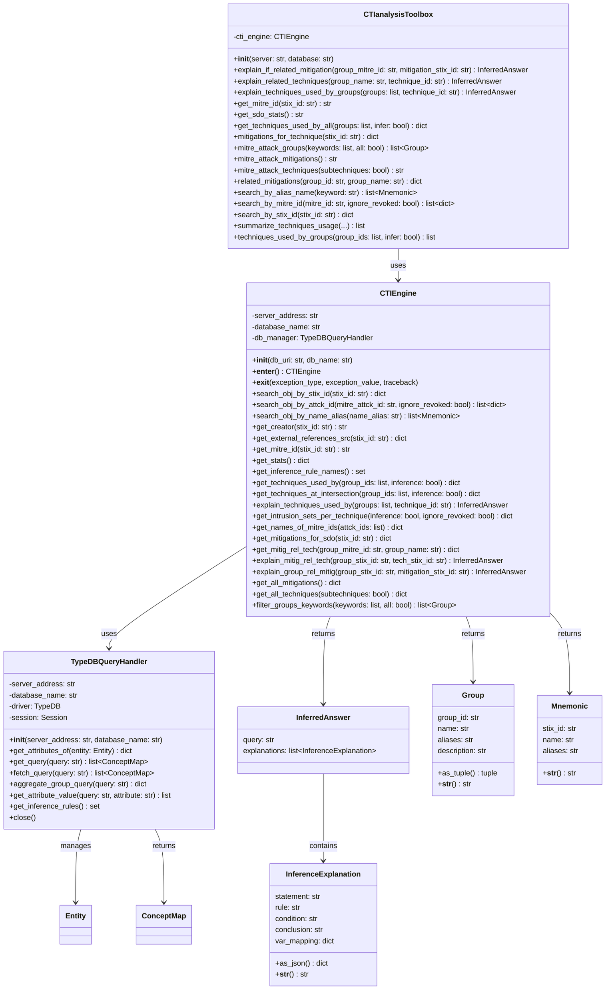

# CTI analysis class diagram

The class diagram below depicts all classes involved when executing a Cyber Threat Intelligence analysis from the `CTIanalysisToolbox`; these classes are distributed across three architectural layers:

- **Service layer**: `CTIanalysisToolbox` - the public API for CTI analysis tasks
- **Engine layer**: `CTIEngine` - core reasoning and query execution
- **Data management layer**: `TypeDBQueryHandler` - database interaction

In addition, `InferredAnswer`, `Group`, `Mnemonic`, and `InferenceExplanation` are data classes for returned analysis results.

{width="70%"}

The CTI analysis process begins with the `CTIanalysisToolbox`, which exposes high-level analysis methods (e.g., `explain_techniques_used_by_groups`, `mitre_attack_groups`, `search_by_mitre_id`). Each method delegates to corresponding methods in the `CTIEngine`, which constructs TypeQL queries and executes them against the TypeDB knowledge base via the `TypeDBQueryHandler`.

Query results are retrieved as `ConceptMap` objects from TypeDB, then transformed into domain-specific result types:

- `InferredAnswer` - encapsulates query explanations when inference rules are applied
- `Group` - represents MITRE ATT&CK threat actor groups
- `Mnemonic` - represents STIX objects found by name or alias search
- Standard `dict` or `list` - for aggregated statistics and technique mappings

The `InferenceExplanation` dataclass provides detailed provenance for inferred facts, including the applied rule, satisfied conditions, and variable mappings between query and rule contexts.