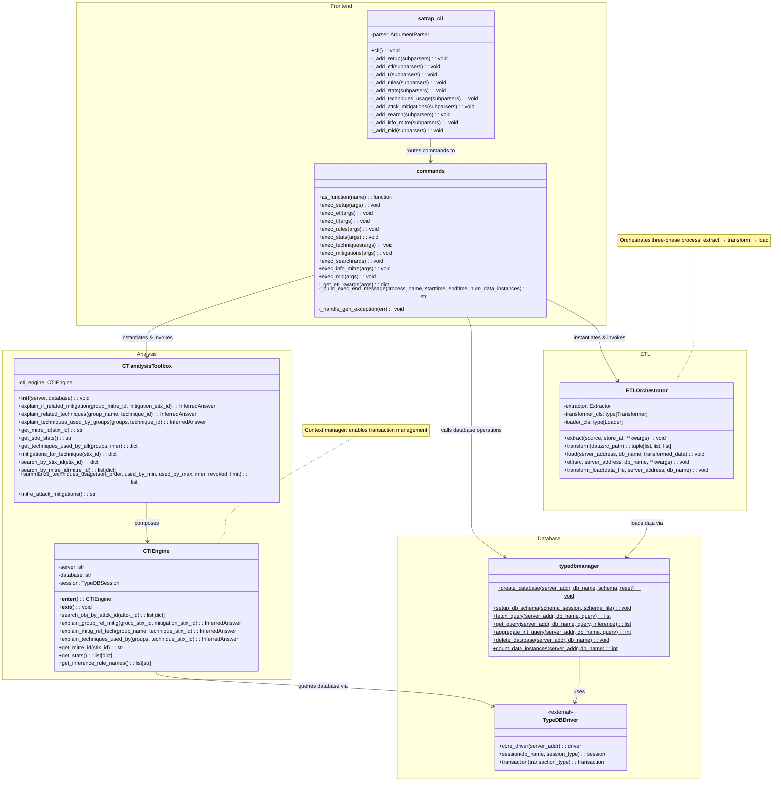

# SATRAP CLI class diagram

This diagram shows a detailed view of the concrete classes, interfaces, and relationships that implement the SATRAP command-line interface and its underlying subsystems.

{width="80%"}

The CLI commands rely on the `ETLOrchestrator` and the `CTIanalysisToolbox` to coordinates the three-phase extract- transform - load pipeline and to perform specific analysis methods (e.g., `explain_if_related_mitigation`) while hiding query complexity.