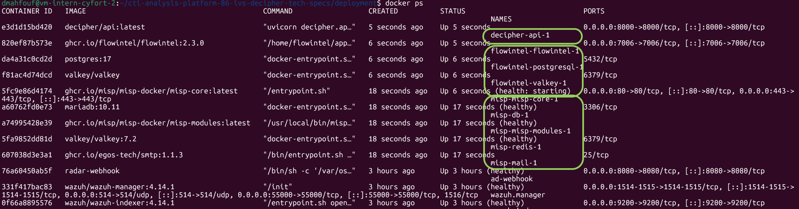

# Test containerized deployment

## Relevant test environment and configuration details

- Software deviations: aligned with test case specification, N/A
- Hardware deviations: aligned with test case specification, N/A

## Test execution results

Here we report the results in terms of step-wise alignments or deviations with respect to the expected outcome of the covered test case.

### AC1, AC4: Full-stack startup

**TC step 1**: Verify that the deployment directory is available from the SATRAP-DL project root folder.

  - ?c5-defect-0: The directory is available and accessible.

**TC steps 2-5**: Copy the `env-template` file to `.env`, configure the environment variables, and run `./decipher_up.sh --all`; then verify running containers with `docker ps`.

  - ?c5-defect-0: All containers (misp-misp-core-1, flowintel-flowintel-1, decipher-api-1) are running and healthy. The `.env` file was correctly configured to map the services.

{: width="80%"}

**TC step 6**: Run `docker volume ls` and verify that there are three volumes prefixed with `flowintel` and two volumes prefixed with `misp`.

  - ?c5-defect-0: `docker volume ls` confirms the presence of three volumes prefixed with `flowintel` and two with `misp`.

**TC step 7**: Open a web browser and verify web services accessibility (MISP, Flowintel, DECIPHER API).

  - ?c5-defect-0: MISP login page, Flowintel, and DECIPHER API are reachable at their respective ports (80, 7006, 8000).

### AC2: Teardown with volume purge

**TC steps 1-3**: Run `./decipher_down.sh --all --purge`, then verify with that all decipher stack containers and volumes are removed.

  - ?c5-defect-0: After running `./decipher_down.sh --all --purge`, `docker ps -a` and `docker volume ls` confirm that all containers and named volumes have been successfully removed.

### AC3: Selective startup

**TC steps 1-3**: Run `./decipher_up.sh --api`, execute the health-check `curl` request, and verify that the DECIPHER API response matches the expected output.

  - ?c5-defect-0: The API started correctly and responds as: `{"status":"ok","service":"decipher-api","analyzers_loaded":1,"available_types":["suspicious_login"],"logging_level":"INFO"}`

**TC step 4**: Run `docker ps -a` and verify that no MISP or Flowintel containers are present.

  - ?c5-defect-0: `docker ps` confirms that only decipher-api-1 is running; no MISP or Flowintel containers were created during the selective `--api` startup.

### Defect summary description

Defect-free test execution, i.e., defect category: ?c5-defect-0

### Text execution evidence

See linked files (if any), e.g., screenshots, logs, etc.

### Comments

N/A

## Guide

- Defect category: ?c5-defect-0; ?c5-defect-1; ?c5-defect-2; ?c5-defect-3; ?c5-defect-4
- Verification method (VM): Test (T), Review of design (R), Inspection (I), Analysis (A)