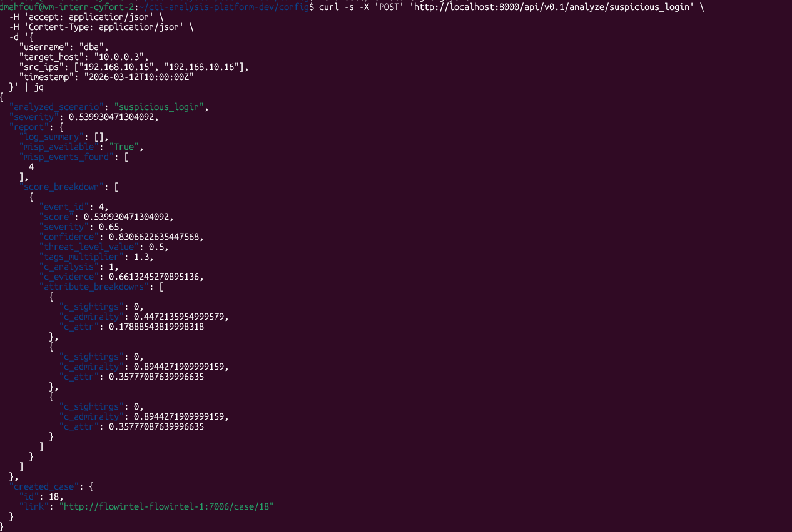
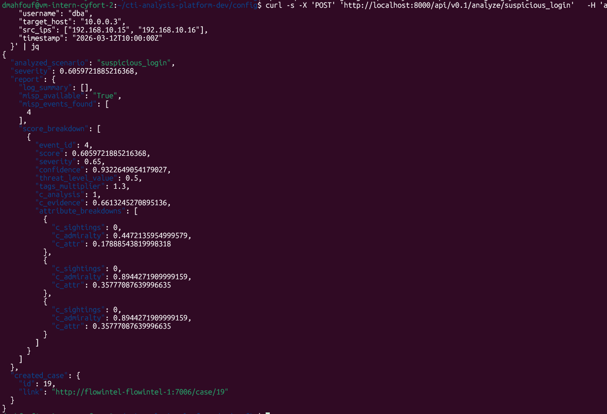

# Test runtime-configurable DECIPHER features

## Relevant test environment and configuration details

- Software deviations: aligned with test case specification, N/A
- Hardware deviations: aligned with test case specification, N/A

## Test execution results

Here we report the results in terms of step-wise alignments or deviations with respect to the expected outcome of the covered test case.

**Test case step 1**: Initial analysis with default thresholds

- ?c5-defect-0: The API returned a severity of 0.54. A case was successfully created in Flowintel with a priority-level:medium tag, as expected for this score.

{: width="65%"}

**Test case step 2-3**: Modification of priority thresholds (high: 0.5)

- ?c5-defect-0: After changing the priority_thresholds in decipher-runtime-cfg.yaml, a new analysis request resulted in a case with a priority-level:high tag, confirming the threshold update was applied instantly.

**Test case step 4-5**: Runtime disabling of case creation

- ?c5-defect-0: Setting enable_case_creation: false in the configuration resulted in a response where created_case.id is 0 and the URL is empty.

**Test case step 6-7**: Update of scoring weights (0.8 analysis / 0.2 empirical)

- ?c5-defect-0: After updating decipher-scoring-cfg.yaml with the new weights, the returned severity increased to approximately 0.606.

{: width="65%"}

**Test case step 8**: Restoration of configuration

The decipher-scoring-cfg.yaml and decipher-runtime-cfg.yaml files were restored to their original states.

### Defect summary description

Defect-free test execution, i.e., defect category: ?c5-defect-0

### Text execution evidence

See linked files (if any), e.g., screenshots, logs, etc.

### Comments
N/A

## Guide

- Defect category: ?c5-defect-0; ?c5-defect-1; ?c5-defect-2; ?c5-defect-3; ?c5-defect-4
- Verification method (VM): Test (T), Review of design (R), Inspection (I), Analysis (A)