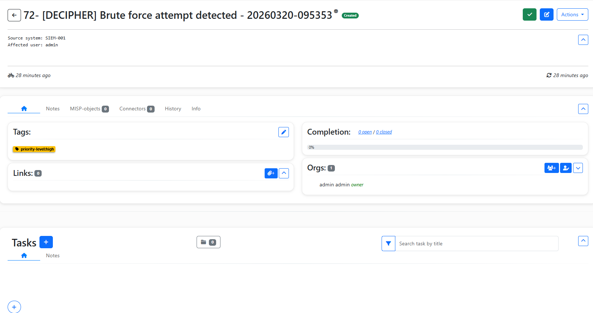
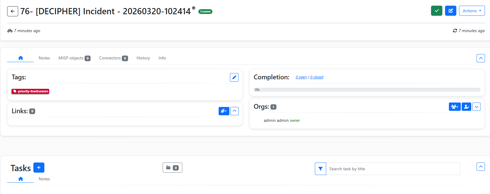
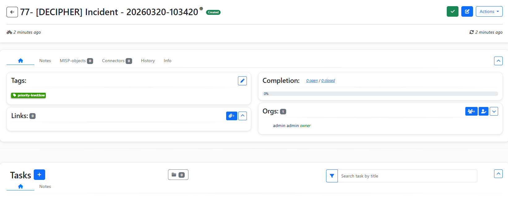
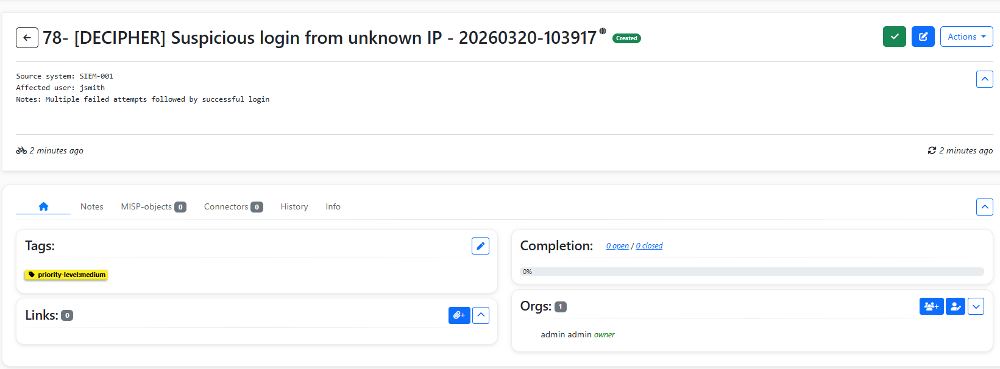

# Test incidents endpoint

## Relevant test environment and configuration details

- Software deviations: aligned with test case specification, N/A
- Hardware deviations: aligned with test case specification, N/A

## Test execution results

Here we report the results in terms of step-wise alignments or deviations with respect to the expected outcome of the covered test case.

### AC1: Valid incident creation

**TC steps 1-5**: Send a POST request with valid data, verify the `HTTP 200` status, verify the non-zero `id` and `link` in the response body, access the case in Flowintel, and verify the title format.

  - ?c5-defect-0: The output contains `HTTP 200`. The response body provides a non-zero `id` and a valid Flowintel link. In Flowintel, the case title is correctly prefixed with `[DECIPHER]` and suffixed with a timestamp.

  ```json
  {"id":72,"link":"http://192.168.0.32:7006/case/72"} HTTP 200
  ```

  {: width="70%"}

### AC2: Invalid score rejection

**TC steps 1-3**: Send a POST request with a score outside the valid range (1.5), verify `HTTP 422`, and verify the validation error message references the score field.

  - ?c5-defect-0: The output contains `HTTP 422`. The response body correctly identifies the validation error on the `score` field.

  ```json
  {"detail":[{"type":"value_error","loc":["body","priority_level"],"msg":"Value error, Invalid MISP priority level 'unclassified'. Valid values: [baseline-minor, baseline-negligible, emergency, high, low, medium, priority-level:baseline-minor, priority-level:baseline-negligible, priority-level:emergency, priority-level:high, priority-level:low, priority-level:medium, priority-level:severe, severe]","input":"unclassified","ctx":{"error":{}}}]} HTTP 422
  ```

### AC3: Priority tag matches requested priority level

**TC steps 1-3**: Send a POST request with `priority_level` set to `priority-level:severe`.

  - ?c5-defect-0: The output contains `HTTP 200`, The created case is accessible by the link and the severity is `severe`.

  ```json
  {"id":76,"link":"http://192.168.0.32:7006/case/76"} HTTP 200
  ```
  {: width="70%"}

**TC steps 4-6**: Send a POST request with `priority_level` set to `low`.

  - ?c5-defect-0: The output contains `HTTP 200`, The created case is accessible by the link and the severity is `low`.

  ```json
  {"id":77,"link":"http://192.168.0.32:7006/case/77"} HTTP 200
  ```
  {: width="70%"}

### AC4: Case description

**TC steps 1-3**: Send a POST request with a `description` object containing additional key-value pairs.

  - ?c5-defect-0: The output contains `HTTP 200`, the created case is accessible by the link and the case description contains the fields provided in the `description` object: `source_system`, `affected_user`, and `notes`.

  ```json
  {"id":78,"link":"http://192.168.0.32:7006/case/78"} HTTP 200
  ```

  {: width="70%"}

### Defect summary description

Defect-free test execution, i.e., defect category: ?c5-defect-0

### Text execution evidence

See linked files (if any), e.g., screenshots, logs, etc.

### Comments

Any additional informative details not fitting in the above sections.

## Guide

- Defect category: ?c5-defect-0; ?c5-defect-1; ?c5-defect-2; ?c5-defect-3; ?c5-defect-4
- Verification method (VM): Test (T), Review of design (R), Inspection (I), Analysis (A)