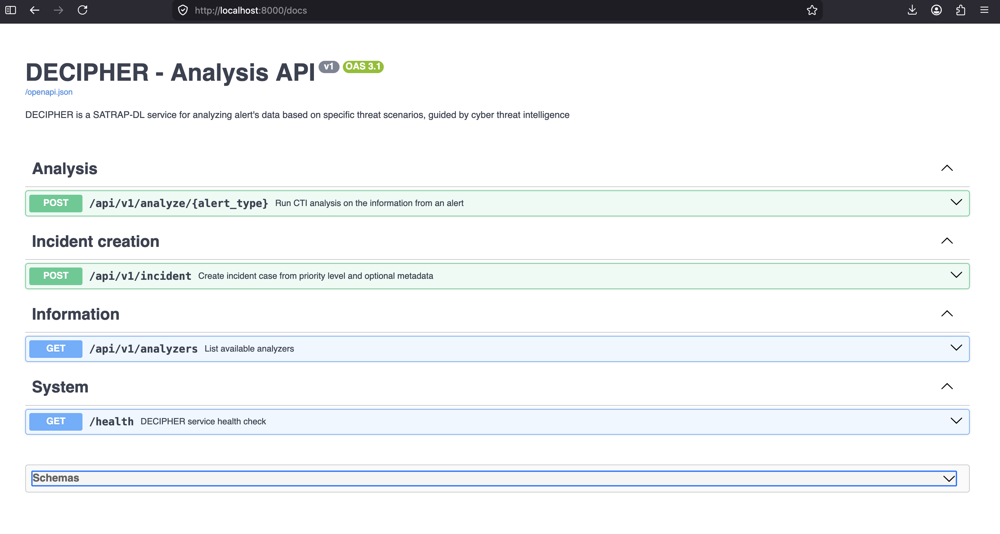

# Test software identification with version

## Relevant test environment and configuration details

- Software deviations: aligned with test case specification
- Hardware deviations: N/A

## Test execution results

Here we report the step-wise alignment or deviation with respect to the expected outcome of the covered test case.

**Test case step 1**: Verify that the SATRAP CLI has a command for retrieving the software name and version

- ?c5-defect-0: The command is available and returns the expected version string.

```bash
$ ./satrap.sh -V
SATRAP v1.0
$ ./satrap.sh --version
SATRAP v1.0
```

**Test case step 2**: Verify that DECIPHER REST API root endpoint provides the service version and identification details

- ?c5-defect-0: The root endpoint provides the expected JSON response with version and identification details.

**Test case step 3**: Verify that the DECIPHER API documentation is accessible and clearly indicates the version in the title and endpoint URLs.

- ?c5-defect-0: The API documentation is accessible at the expected URL and clearly shows the version in the title and endpoint URLs.

{: width="70%"}

### Defect summary description

Defect-free test execution, i.e., defect category: ?c5-defect-0

### Text execution evidence

See screenshots and terminal output above.

### Comments

N/A

## Guide

- Defect category: ?c5-defect-0; ?c5-defect-1; ?c5-defect-2; ?c5-defect-3; ?c5-defect-4
- Verification method (VM): Test (T), Review of design (R), Inspection (I), Analysis (A)