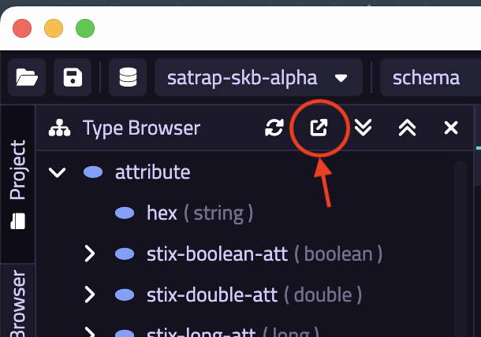

# Test setup + MITRE ATT&CK ingestion

Test the SATRAP initialization and setup/deployment scripts and its mechanism for retrieving datasets from MITRE ATT&CK in STIX 2.1, and making them available for other system components to adequately process and insert the information into the CTI SKB.

## Preconditions and setup actions
- Access to the SATRAP-DL deployment artifacts
- Access to the internet or a pre-downloaded copy of MITRE ATT&CK data sets in STIX 2.1, e.g., the enterprise TTPs
- TypeDB Docker container pulled and running using the `init-satrap.sh` script
- SATRAP Docker network created using the `init-satrap.sh` script
- SATRAP volume for persistent TypeDB storage created using the `init-satrap.sh` script
- Docker Engine (or daemon) running with the right privileges for the testing user
- `TypeDB Studio` version `2.28.6` installed: [Link to GitHub release](https://github.com/typedb/typedb-studio/releases/tag/2.28.6) (alternatively you can interact with the TypeDB backend directly via its CLI)
- A plain/empty project created in TypeDB Studio
- SATRAP Docker container created using the `build-satrap.sh` script

## Test steps
1. Run the SATRAP `setup` CLI command to create the SATRAP TypeDB data schema for STIX 2.1 and load it into the CTI SKB.

```
$ ./satrap.sh setup

Starting SATRAP...
Database 'satrap-skb-alpha' will be created at 'typedb:1729'
Do you want to continue? (y/n): y
Database 'satrap-skb-alpha' successfully created from:
Schema: /home/alab/cti-analysis-platform/satrap/assets/schema/cti-skb-types.tql
Rules: /home/alab/cti-analysis-platform/satrap/assets/schema/cti-skb-rules.tql
```

2. Run the SATRAP `etl` CLI command to run the ETL (Extract, Transform, Load) pipeline for the ATT&CK enterprise TTP data set selected by default, confirm by typing `yes` and pressing enter.

```
$ ./satrap.sh etl

Starting SATRAP...

The ETL process will be executed with the following parameters (modify at 'satrap_params.yml'):

Extraction datasource: https://raw.githubusercontent.com/mitre-attack/attack-stix-data/master/enterprise-attack/enterprise-attack.json
Load into: database 'satrap-skb-alpha' at typedb:1729

Do you want to continue? (yes/no): yes

Logging to file: /home/alab/cti-analysis-platform/satrap/assets/logs/2025-03-29/info.log
```

## Expected outcome
1. Start `TypeDB Studio`, select your database as shown below (`satrap-skb-alpha`):

{: width="60%"}

- Open your previously created TypeDB project (or create a fresh one)
- Press the `Export Schema Types` button from the TypeDB Browser, as shown below

{: width="20%"}

- Save the exported content in a `.tql` file, e.g., `test-schema.tql` and compare the content of this file with the evidence provided in our test data (a simple `diff` will do); the path to the reference schema is indicated here.

2. Once the ETL execution is finished, the printout in the terminal should read a total of `215498` entries. Note that the correctness of the actual mappings and correspondence soundness between the transformed content loaded into TypeDB is tested via our comprehensive unit test suites found under `tests` folder at the project root, which can be run using our `run_tests.sh` script.