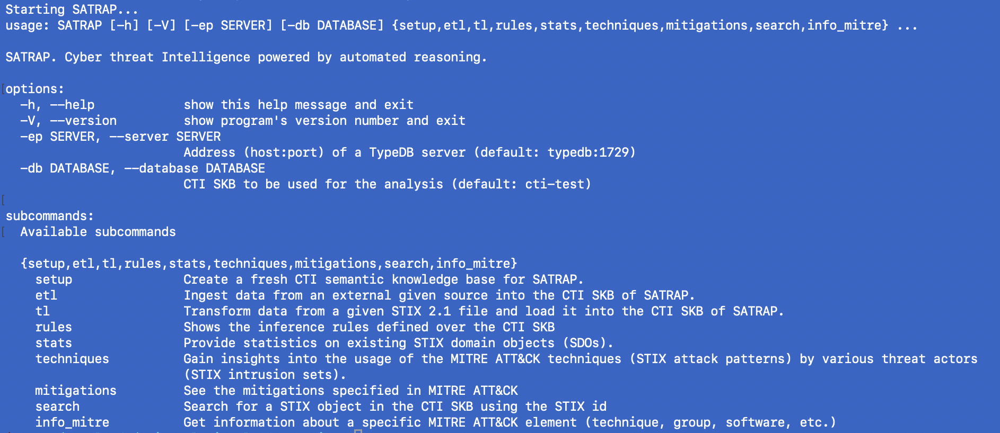
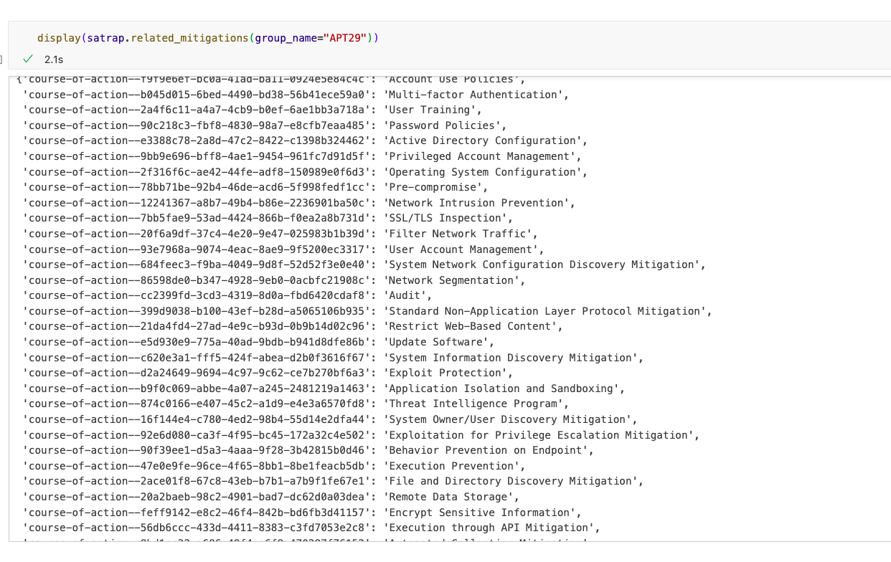
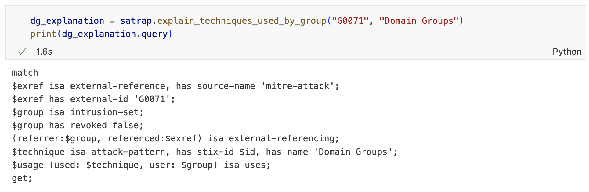
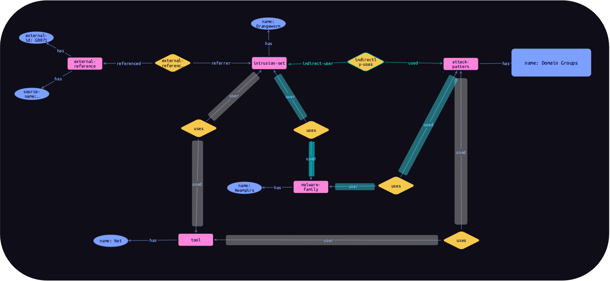

# SATRAP

_Semi-Automated Threat Reconnaissance and Analysis Platform_ (**SATRAP**) is a platform for interactive computer-aided analysis of cyber threat intelligence (CTI) driven by logic-based automated reasoning.


## Table of contents

- [Overview](#overview)
- [Features](#features)
- [User manual](#user-manual)
- [Getting started](#getting-started)
- [Usage](#usage)
- [Unit and validation tests](#unit-and-validation-tests)
- [Project status](#project-status)
- [Roadmap](#roadmap)


## Overview
 

The main purpose of SATRAP is to (semi-)automate deductive tasks involved in the analysis of CTI allowing analysts to ask high-level questions and get explainable answers, thus helping reduce manual memory-intensive correlation work.

At its core, SATRAP implements a **knowledge representation system (KRS)**: a structured knowledge base of cyber threat intelligence with formal semantics, plus a reasoning engine that can infer new relationships from existing data. Queries can return both, stored facts and derived relations, along with the reasoning steps that explain the derivation.

SATRAP complements existing open-source threat intelligence platforms such as [MISP](https://misp-project.org/) and [OpenCTI](https://github.com/OpenCTI-Platform/opencti). Integration with such tools for automated inference over CTI streams is expected in future releases; currently, SATRAP can be used with such tools by transferring content via the provided interfaces.

## Features

### Functionality

* A toolbox of functions for supporting CTI analysis powered by an inference engine
* An extract-transform-load (ETL) mechanism for ingesting STIX2.1 data from CTI sources into the knowledge base of SATRAP

### Core features
* A knowledge representation system for CTI implemented on top of [TypeDB](https://typedb.com/features) (v2.29.0)
* A data model based on [STIX 2.1](https://oasis-open.github.io/cti-documentation/stix/intro.html), enabling:
  * exchange of threat information with repositories and security tools such as MITRE ATT&CK data sets, TIPs (e.g., MISP, OpenCTI), SIEM and IDPS (e.g., [IDPS-ESCAPE](https://github.com/AbstractionsLab/idps-escape), Wazuh and Suricata)
  * a common language for reasoning over CTI
* A predefined set of inference rules and queries, extensible with user-defined ones
* An intuitive language for defining new derivation rules in terms of STIX2.1 concepts, thanks to the underlying semantic technology
* A CTI knowledge base that can be directly queried in [TypeQL](https://typedb.com/docs/typeql/2.x/), the native language of TypeDB


### Interfaces
- A command-line interface (SATRAP CLI) for efficient user interaction
- A light-weight Python library (`CTIAnalysisToolbox`) providing a preliminary toolbox of analytic functions for supporting CTI investigations. These functions perform automated reasoning over the information in the knowledge base.
- A frontend based on Jupyter Notebooks importing the `CTIAnalysisToolbox` for creating playbooks or user-defined queries
- [TypeDB Studio](https://typedb.com/docs/manual/2.x/studio) (third-party, optional), the GUI of TypeDB, for an interactive visualization of explainable queries

## User manual

To learn more about the fundamentals of SATRAP as well as details on the installation, setup requirements, usage, and overall functionality, please refer to the [SATRAP user manual](../docs/manual/satrap/README.md).

## Getting started

Currently, SATRAP offers two deployment options:

- A command-line interface (CLI) in your OS shell of choice
- A containerized analysis environment in VS Code

Below we describe the deployment of the command-line interface. For the deployment of a development environment, please see the [installation page](../docs/manual/satrap/installation.md) of the user manual.

### Prerequisites

* [Docker engine](https://docs.docker.com/engine/) running

### Setup

1. Clone or download the source code of this repository.

    ```sh
    git clone https://github.com/AbstractionsLab/satrap-dl.git
    ```

1. In a terminal, go to the project's root folder (when cloning, `satrap-dl`) and ensure execution rights on the scripts.

    ```sh
    cd satrap-dl
    ```

    ```sh
    chmod +x *.sh deployment/*.sh
    ```

1. Run the [satrap_up.sh](../deployment/satrap_up.sh) script to bring up a persistent TypeDB server on a `satrap-net` Docker network and build the SATRAP Docker image.

    ```sh
    ./deployment/satrap_up.sh
    ```

    TypeDB is exposed on host port `1729` by default; pass `-p PORT` to use a different port.

    **Note:** The same script supports several deployment options. See the manual for details.

At this point, the CLI can be used as described in the [Usage](#usage) section below.

### Bring down SATRAP
Run [satrap_down.sh](../deployment/satrap_down.sh) to stop TypeDB and optionally remove the knowledge base volume and the SATRAP image. See the manual for details.

## Usage
### Configuration parameters
The default configuration parameters, including settings for the connection to TypeDB and logging level, can be modified in [assets/satrap_params.yml](assets/satrap_params.yml).

Unless otherwise specified, e.g. by command arguments, the CLI and the Python toolbox run the commands and functions using the knowledge base specified by the TypeDB parameters in the mentioned file.

### SATRAP command-line interface
The command-line interface of SATRAP is primarily intended for setting up a fresh CTI knowledge base and executing an extract-transform-load (ETL) pipeline to ingest content in STIX and populate the said knowledge base.

A minimal set of analytical functions is also available through this interface, however, we recommend the use of the Python library described [below](#satrap-as-a-python-library) for tasks related to the analysis of CTI as it provides a larger set of functions.

To access the SATRAP CLI, simply go the project root folder (`cd satrap-dl`) and run:

```sh
./satrap.sh
```

The help menu is shown if no arguments are provided.



#### Quick setup of a CTI SKB with MITRE ATT&CK Enterprise
To create and populate a knowledge base with the [default parameters](#configuration-parameters) run:

```sh
./satrap.sh setup
./satrap.sh etl
```

This will create a knowledge base called `satrap-skb-alpha` and ingest the latest version of the [MITRE ATT&CK Enterprise](https://github.com/mitre-attack/attack-stix-data) dataset.


For more information about the commands exposed in the CLI, please take a look at the [SATRAP interfaces](../docs/manual/satrap/interfaces.md) section of the user manual.


### SATRAP as a Python library
We recommend the use of Jupyter Notebooks to interact with the Python toolkit of SATRAP in a structured manner and to implement your own playbooks.

See our ["Effective countermeasures against a group of interest" notebook](../docs/notebooks/effective_measures.ipynb) and the "Quick start" in [frontend](frontend) for examples on the usage of the toolbox.

#### Integration in a Jupyter Notebook
For instance, we can try to find courses of action that mitigate any of the techniques used by the group "APT29". This function makes use of the inference rules defined in our KRS.



#### Graphical explanations in TypeDB Studio
SATRAP provides textual explanations for "explanation functions" in the toolbox. As a complementary frontend, we can leverage the use of TypeDB Studio for an interactive graphical explanation of the inferred knowledge.

For example, we run the explanation function `explain_techniques_used_by_group` to understand whether and why the group "Orangeworm" (ATT&Ck id "G0071") uses the technique "Domain Groups". Then:

1. We retrieve the executed query in the native database language (TypeQL).



2. We copy and run the query in TypeDB Studio to see the derivation paths as a graph.



<br/>

**NOTE:** integration of visual explanations in Jupyter Notebooks and in the development environment is considered for future releases (see the [Roadmap](#roadmap) below).

For more information on the topic, see the page on [Running investigations](../docs/manual/satrap/playbooks.md) in the user manual.

## Unit and validation tests

SATRAP comes with an extensive suite of unit tests. To run all SATRAP tests, simply execute the following command from the project root:

```bash
./run_tests.sh satrap
```

For additional test execution options, see the [installation page](../docs/manual/satrap/installation.md#running-unit-tests) of the user manual.

For software validation test cases and reports, please refer to the test case specifications ([TST](https://abstractionslab.github.io/satrap-dl/traceability/TST.html)) and test campaign results ([TRP](https://abstractionslab.github.io/satrap-dl/traceability/TRP.html#TRP-SATRAP)) on our [traceability web page](https://abstractionslab.github.io/satrap-dl/traceability/index.html).

## Project status
This repository hosts a stable, yet basic version of SATRAP in terms of CTI analysis functionality. The release provides the core components and foundations of the project, in particular, the knowledge base schema, the ETL process, the CTI analysis engine and a minimal set of demonstrative functions for the analysis of CTI as a Python library.

The project is intended to serve as an extensible baseline with a simple deployment model and a clean architecture, customizable depending on specific use cases and requirements.

⚠️ **Disclaimer**: Although this software is stable, we recommend conducting a thorough security assessment before deploying SATRAP in production.

## Roadmap

We may consider the integration of data from existing open-source semantic CTI repositories, e.g. [MITRE D3FEND](https://d3fend.mitre.org/) in a future release.

**Further features that may be implemented upon request**:

* Extend and improve the elementary analysis capabilities of the native Python library API (on a use case basis).
* Define a platform-independent API (e.g., a REST API) enabling programmatic access to the services provided by SATRAP.
* Create further playbooks to demonstrate the use of SATRAP for automating reasoning tasks in common CTI investigative scenarios.
* Migration to TypeDB `3.x`
* Transform TypeQL results into STIX2.1 objects (reverse ETL).